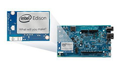
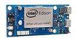

Getting started guides for the Intel® Edison.

### What breakout board do you have?

---

**Intel® Edison Kit for Arduino & Grover Starter Kit**
  

* **JavaScript with the Intel® XDK** or **C/C++ with Eclipse IDE**: [START HERE »](START_HERE/arduino_expansion_board.md)
* **Arduino IDE**: [START HERE »](https://software.intel.com/en-us/articles/install-arduino-ide-on-intel-iot-platforms)

---

**Mini Breakout Board for Intel® Edison**
  

* **All platforms**: [START HERE »](https://software.intel.com/en-us/assembling-intel-edison-board-with-intel-edison-mini-breakout-board)

---

**Xadow Wearables Kit for Intel® Edison**
  

* **JavaScript with the Intel® XDK** or **C/C++ with Eclipse IDE**: [START HERE »](START_HERE/xadow_wearables_kit.md)
* **Arduino IDE**: [START HERE »](http://www.seeedstudio.com/wiki/Xadow_Wearable_Kit_For_Edison)

---

### Contributing

We welcome pull requests and bug reports on these docs. Please read [CONTRIBUTOR.md](CONTRIBUTOR.md) for more information.
