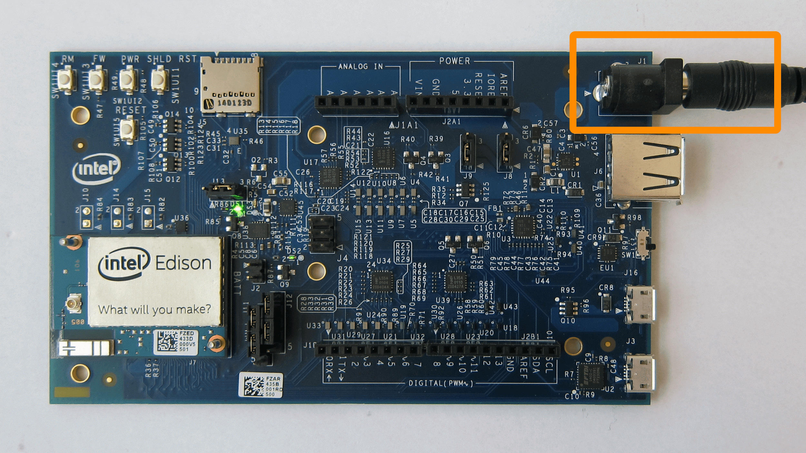

# Connecting cables

Explore when and how to use all the cables ports on the Intel® Edison kit for Arduino. 

**Table of contents**

* [Device mode micro-USB cable](#device-mode-micro-usb-cable)
* [UART/serial micro-USB cable](#uartserial-micro-usb-cable)
* [DC power supply](#dc-power-supply)
* [Host mode USB cable](#host-mode-usb-cable)

**Related video**

### Device mode micro-USB cable

Use the top micro-USB port in USB device mode for:

* 5V power, 
* programming the Intel® Edison using the Arduino IDE, 
* programming the Intel® Edison using the Intel® XDK or Eclipse IDE included in the Intel® IoT Developer Kit via Ethernet over USB (not Wi-Fi), and
* writing to the onboard flash memory from your computer.

1. Find the **microswitch** in between the USB ports on the expansion board. 
Switch the microswitch **_down _**towards the micro-USB ports, if it isn't already.

  

  ---

  **What does this microswitch do?**

  The slider switches between USB host mode and USB device mode. 

  **Device mode:** The switch is toggled down and a micro-USB cable can be used to turn the Intel® Edison into a computer peripheral. Device mode allows you to do such things as: program the board over USB, or mount the onboard flash memory like a disk drive. 

  **Host mode:** The switch is toggled up and USB peripherals with a standard-sized USB cable (such as mice, keyboards, etc) can be plugged into the Intel® Edison. USB host mode requires the use of an external power adapter. Refer to [Host mode USB cable](#host-mode-usb-cable) later in this document.

  ---

2. Plug a micro-USB cable into the **_top_** micro-USB connector on the expansion board.

  

3. Connect the other end of the USB cable into your computer.

  

4. A green LED should light up on the expansion board. 

  

5. Wait one minute for the Intel® Edison to finish booting up.

  ---

  **How do you know when the board is ready?**

  You will know that the Intel® Edison is fully initialized when your computer mounts a new drive (much like inserting a SD card into your computer).

  The Intel® Edison needs approximately one minute to go through the entire Linux startup process. There is no onboard LED to indicate whether or not the Intel® Edison is fully initialized, however you can watch the full bootup sequence (whether for fun or for debugging purposes) if you are connected to the board via the bottom micro-USB cable. You will learn how to gain command line access to your Intel® Edison later in [Shell Access](../README.md#3-shell-access).

  

  ---

## UART/serial micro-USB cable

Use the bottom micro-USB port to send serial commands to your Intel® Edison via Terminal or PuTTY. Use these commands to flash firmware, configure Wi-Fi, or identify the board's IP address.

1. Power the Intel® Edison via the **device mode** micro-USB port and/or via the power barrel connector.

   or 

2. Plug a micro-USB cable into the **_bottom_** serial micro-USB connector on the expansion board. 

  

3. Connect the other end of the USB cable into your computer.

  

---

Refer to [Shell Access](../README.md#3-shell-access) for more instructions on gaining command line access.

---

Once your Intel® Edison is online and has an addressable IP address, you may find it more convenient to SSH into your board to run Linux commands. In that case, you will not need the micro-USB serial cable on a regular basis.

---

## DC power supply

If you are going to use more power intensive features such as Wi-Fi, a servo motor, or an Arduino shield, use a DC power supply in addition to the device mode micro-USB cable.

1. Plug in a 7 to 15 VDC input DC power supply to the barrel connector.
(This DC power supply could be plugged into the wall, or be part of a battery pack.)

  

2. A green LED should light up on the expansion board.

  

3. Wait one minute for the Intel® Edison to finish booting up.

## Host mode USB cable

Use the standard-sized USB port in USB host mode to allow the Intel® Edison to accept USB peripherals such as mice, keyboards, etc.

1. Find the **microswitch** in between the USB ports on the expansion board. 
Switch the microswitch ***up*** towards the standard-sized USB port, if it isn't already.

  

  ---

  **What does this microswitch do?**

  The slider switches between USB host mode and USB device mode. 

  **Device mode:** The switch is toggled down and a micro-USB cable can be used to turn the Intel® Edison into a computer peripheral. Device mode allows you to do such things as: program the board over USB, or mount the onboard flash memory like a disk drive. Refer to [Device mode micro-USB cable](#device-mode-micro-usb-cable) earlier in this document.

  **Host mode:** The switch is toggled up and USB peripherals with a standard-sized USB cable (such as mice, keyboards, etc) can be plugged into the Intel® Edison. USB host mode requires the use of an external power adapter.

  ---

2. Plug in the DC power supply to the barrel connector since USB host mode **requires** the use of an external power adapter.

  

3. Plug a USB peripheral with a standard-sized USB connector into the USB port above the microswitch on the expansion board.

  

---

### Next Steps

Install software and drivers specifically for your computer's operating system. 

* **Mac user?** 

  You have no special setup. Skip to [Shell Access - Mac »](../shell_access-mac-linux/serial_connection-mac.md).

* **Linux user?** 

  You have no special setup. Skip to [Shell Access - Linux »](../shell_access-mac-linux/serial_connection-linux.md).

* **Windows 64-bit user?** 

  [Set Up Your Computer - Windows (64-bit integrated installer) »](../set_up_your_computer-windows/64bit_integrated_installer.md)

* **Windows 32-bit user?** *Or can't get 64-bit integrated installer running?* 

  [Set Up Your Computer - Windows (manual installation) »](../set_up_your_computer-windows/manual_installation.md)
