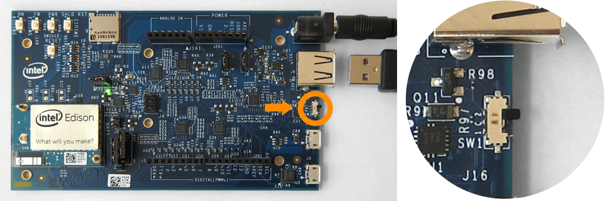
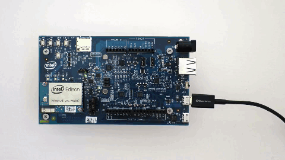

# Connecting cables

Explore when and how to use all the cables ports on the Intel® Edison kit for Arduino. 

**Table of contents**

* [Device mode vs host mode »](#device-mode-vs-host-mode)
* [Device mode micro-USB cable »](#device-mode-micro-usb-cable)
* [UART/serial micro-USB cable »](#uartserial-micro-usb-cable)
* [DC power supply »](#dc-power-supply)
* [Host mode USB cable »](#host-mode-usb-cable)

**Related video**

## Device mode vs host mode

The hardware slider on the Arduino expansion board switches between USB _host mode_ and USB _device mode_. 

**Device mode:** The switch is toggled down and a micro-USB cable can be used to turn the Intel® Edison into a computer peripheral. Device mode allows you to do such things as: program the board over USB, or mount the onboard flash memory like a disk drive. Refer to [Device mode micro-USB cable »](#device-mode-micro-usb-cable)

**Host mode:** The switch is toggled up and USB peripherals with a standard-sized USB cable (such as mice, keyboards, etc) can be plugged into the Intel® Edison. USB host mode requires the use of an external power adapter. Refer to [Host mode USB cable  »](#host-mode-usb-cable)

## Device mode micro-USB cable

Use the top micro-USB port in USB device mode for:

* 5V power, 
* programming the Intel® Edison using the Arduino IDE, 
* programming the Intel® Edison using the Intel® XDK or Eclipse IDE included in the Intel® IoT Developer Kit via Ethernet over USB (not Wi-Fi), and
* writing to the onboard flash memory from your computer.

[View detailed instructions »](details-device_mode_cable.md)

## UART/serial micro-USB cable

Use the bottom micro-USB port to send serial commands to your Intel® Edison via Terminal or PuTTY. Use these commands to flash firmware, configure Wi-Fi, or identify the board's IP address.

[View detailed instructions »](details-serial_cable.md)

## DC power supply

If you are going to use more power intensive features such as Wi-Fi, a servo motor, or an Arduino shield, use a DC power supply in addition to the device mode micro-USB cable.

[View detailed instructions »](details-power_barrel.md)

## Host mode USB cable

Use the standard-sized USB port in USB host mode to allow the Intel® Edison to accept USB peripherals such as mice, keyboards, etc.

[View detailed instructions »](details-host_mode_cable.md)

---

### Next Steps

Install software and drivers specifically for your computer's operating system. 

* **Mac user?** 

  You have no special setup. Skip to [Shell Access - Mac »](../shell_access-mac-linux/serial_connection-mac.md).

* **Linux user?** 

  You have no special setup. Skip to [Shell Access - Linux »](../shell_access-mac-linux/serial_connection-linux.md).

* **Windows 64-bit user?** 

  [Set Up Your Computer - Windows (64-bit integrated installer) »](../set_up_your_computer-windows/64bit_integrated_installer.md)

* **Windows 32-bit user?** *Or can't get 64-bit integrated installer running?* 

  [Set Up Your Computer - Windows (manual installation) »](../set_up_your_computer-windows/manual_installation.md)
