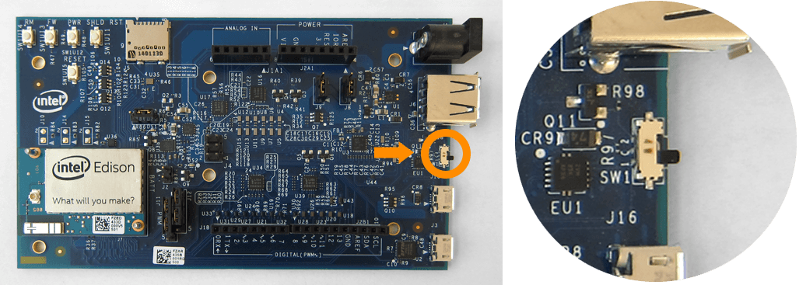
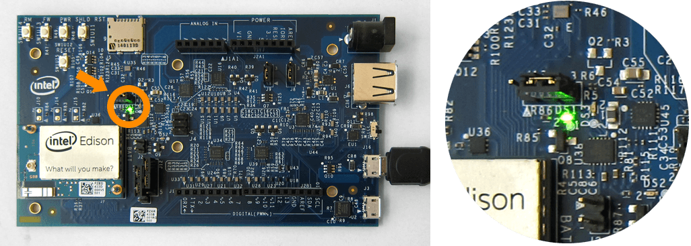

## Device mode micro-USB cable

Use the top micro-USB port in USB device mode for:

* 5V power, 
* programming the Intel® Edison using the Arduino IDE, 
* programming the Intel® Edison using the Intel® XDK or Eclipse IDE included in the Intel® IoT Developer Kit via Ethernet over USB (not Wi-Fi), and
* writing to the onboard flash memory from your computer.

---

1. Find the microswitch in between the USB ports on the expansion board. 
Switch the microswitch _down_ towards the micro-USB ports, if it isn't already.

  

2. Plug a micro-USB cable into the **_top_** micro-USB connector on the expansion board.

  

3. Connect the other end of the USB cable into your computer.

  

4. A green LED should light up on the expansion board. Wait one minute for the Intel® Edison to finish booting up.

  

---

**How do you know when the board is ready?**

You will know that the Intel® Edison is fully initialized when your computer mounts a new drive (much like inserting a SD card into your computer).

---

The Intel® Edison needs approximately one minute to go through the entire Linux startup process. There is no onboard LED to indicate whether or not the Intel® Edison is fully initialized, however you can watch the full bootup sequence (whether for fun or for debugging purposes) if you are connected to the board via the bottom micro-USB cable. You will learn how to gain command line access to your Intel® Edison later in [Shell Access](../shell_access/).

---