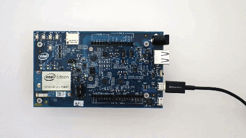
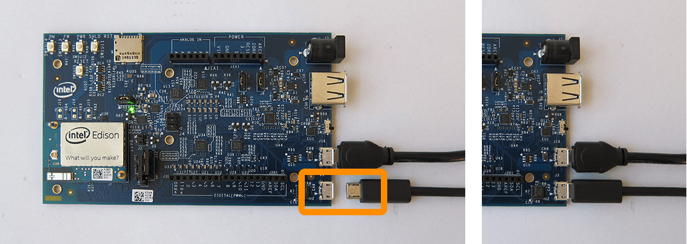
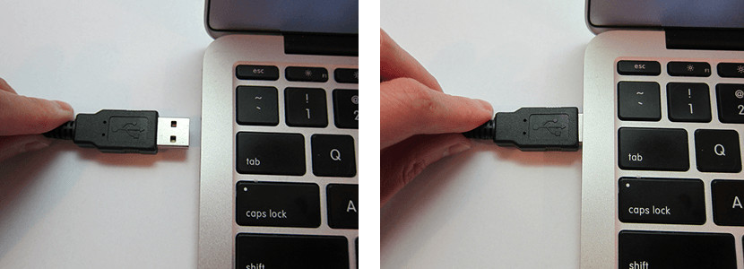
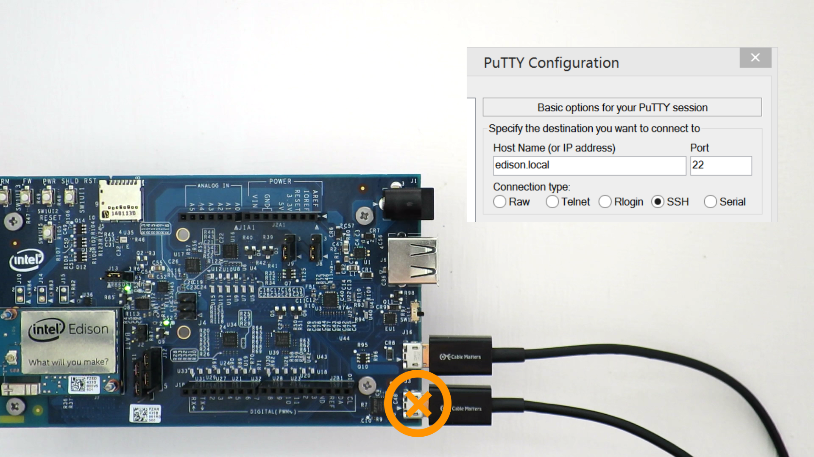

## UART/serial micro-USB cable

Use the bottom micro-USB port to send serial commands to your Intel® Edison via Terminal or PuTTY. Use these commands to flash firmware, configure Wi-Fi, or identify the board's IP address.

---

1. Power the Intel® Edison via the **device mode** micro-USB port and/or via the power barrel connector.

   or 

2. Plug a micro-USB cable into the **_bottom_** serial micro-USB connector on the expansion board. 

  

3. Connect the other end of the USB cable into your computer.

  

---

Refer to [Shell Access](/shell_access/) for more instructions on gaining command line access.

---

Once your Intel® Edison is online and has an addressable IP address, you may find it more convenient to SSH into your board to run Linux commands. In that case, you will not need the micro-USB serial cable on a regular basis.

---