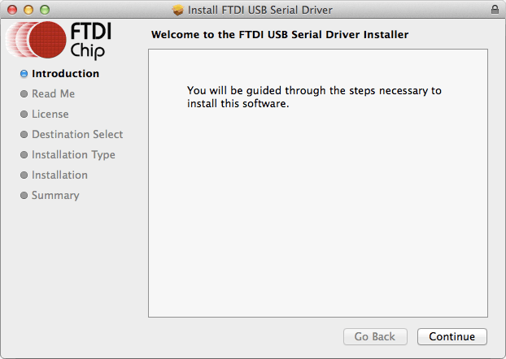

# Set Up Your Computer - Mac

_Instructions for the **Xadow Wearables Kit for Intel® Edison** on **Mac**_

This setup document will guide you through preparing your computer with Mac-specific drivers required for the Xadow Wearables Kit for Intel® Edison.

---

**Are you using the Intel® Edison Kit for Arduino expansion board?**

You do not need to go through this step. This document is for installing serial drivers for the Xadow programmer board. Continue to [Shell Access - Mac](/shell_access/mac/serial_connection.md).

---

**Table of contents**

* [Download and install FTDI VCP serial drivers](#download-and-install-ftdi-vcp-serial-drivers)

**Related videos**

* Coming soon

# Download and install FTDI VCP serial drivers

FTDI Virtual COM port (VCP) drivers allow your Mac to communicate with the Intel® Edison over USB serial when the Intel® Edison is attached to the Xadow expansion board and programmer.

1. Get the latest FTDI VCP driver installer.

  **Hackathon attendees:**

  1. On the USB key: files → Mac
  2. Copy *FTDIUSBSerialDriver_version.dmg* to your computer.

  **Online option:**

  1. Visit [ftdichip.com/Drivers/VCP.htm](http://ftdichip.com/Drivers/VCP.htm). 
  2. Scroll down to the "**Currently Supported VCP Drivers**" table. 
  3. Click the version number link in the "**x64 (64-bit)**" column for your Mac OS version to download **FTDIUSBSerialDriver_version.dmg** to your computer.

2. Click on **FTDIUSBSerialDriver_version.dmg** to extract the installer package.

3. In the new Finder window, click on **FTDIUSBSerial.pkg** to start the installer.

4. Follow the installation wizard prompts. Click "**Next**" where needed.

  

5. Click "**Finish**" to close the installation wizard.

6. Restart your Mac for driver changes to take effect. **You must restart your computer for driver changes to take effect!**

---

### Next Steps

Gain command line access of your IoT board. Execute special Linux commands to configure your IoT board such as setting up Wi-Fi. 

[Shell Access - Mac »](/shell_access/mac/serial_connection.md)