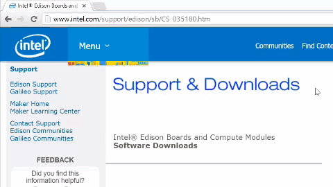
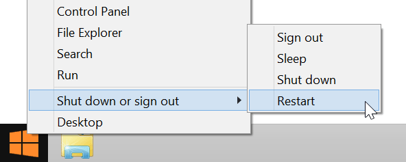

# Set Up Your Computer - Windows (64-bit integrated installer)

The Windows 64-bit integrated installer program gives you options to automatically install Windows drivers and an IDE of your choice for Intel® Edison development. You can also use the integrated installer program to flash the latest firmware image on your Intel® Edison.

This setup document will guide you through preparing your computer with the Intel® Edison Windows 64-bit integrated installation program.

---

**Are you running 32-bit Windows? Unable to use the integrated installer?**

You will need to install the Windows drivers manually. Refer to [Set Up Your Computer - Windows (manual installation)](manual_installation.md). 

---

**Table of contents**

* [Download and run the Intel® Edison integrated installer »](#download-and-run-the-intel-edison-integrated-installer)
* [Restart your computer »](#restart-your-computer)

**Related videos**

[Intel Edison: Set Up Your Computer - Windows Integrated Installer (preview video)](https://drive.google.com/open?id=0B6gHgawzKtxCejNuYjc3a216X3M&authuser=0)

## Download and run the Intel® Edison integrated installer

The [Windows 64-bit Integrated Installer](https://software.intel.com/iot/hardware/edison/downloads) gives you options to automatically install:

* Intel® Edison and FTDI serial drivers on your Windows computer,
* an IDE of your choice (Arduino, Intel XDK® for IoT, and/or Eclipse), and
* the latest firmware image on your Intel® Edison.

[View detailed instructions »](details-install_integrated_installer.md)

## Restart your computer

To ensure driver installation changes take effect, reboot your Windows computer at this point.

---

### Next Steps

[Confirm driver installation »](confirm_drivers.md)
