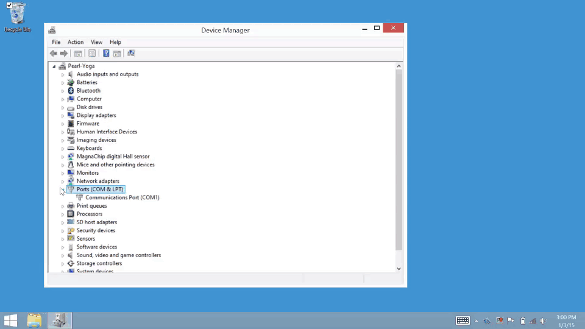

# Confirm driver installation - Windows 

**Table of contents**

* [Open Windows Device Manager »](#open-windows-device-manager)
* [Confirm installation of Intel® Edison Drivers »](#confirm-installation-of-intel-edison-drivers)
* [Confirm installation of FTDI serial drivers »](#confirm-installation-of-ftdi-serial-drivers)

**Related videos**

* [Intel Edison: Set Up Your Computer Manually - Windows (preview video)](https://drive.google.com/open?id=0B6gHgawzKtxCbUxicmpBc2JZSmM&authuser=0)
* [Intel Edison: Set Up Your Computer - Windows Integrated Installer (preview video)](https://drive.google.com/open?id=0B6gHgawzKtxCejNuYjc3a216X3M&authuser=0)

## Open Windows Device Manager

Launch the Device Manager utility on Windows in order to debug your Intel® IoT board USB connections. [View detailed instructions »](details-open_device_manager.md)

## Confirm installation of Intel® Edison Drivers

Look for both "Intel Edison USB Composite Device" and "Intel Edison Virtual Com Port" items in Device Manager under “Ports (COM & LPT)” after plugging in the device mode USB cable. [View detailed instructions »](details-confirm_edison_drivers.md)

## Confirm installation of FTDI serial drivers

Look for "USB Serial Port" in Device Manager under “Ports (COM & LPT)” after plugging in the UART/serial USB cable. [View detailed instructions »](details-confirm_ftdi_cdm_drivers.md)

---

### Next Steps

Gain command line access of your IoT board. Execute special Linux commands to configure your IoT board such as setting up Wi-Fi. 

[Shell Access - Windows »](/shell_access/windows/serial_connection.md)