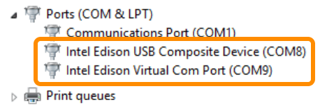

## Confirm installation of Intel® Edison Drivers

Look for both "Intel Edison USB Composite Device" and "Intel Edison Virtual Com Port" items in Device Manager under “Ports (COM & LPT)” after plugging in the device mode USB cable.

---

1. Connect a micro-USB cable to the **device mode** micro-USB port of the Intel® Edison expansion board, and the other end to your computer.

  

  Refer to [Device mode micro-USB cable](/assembly/arduino_expansion_board/details-device_mode_cable.md) for more detailed cable connection information.

---

If you see both "**Intel Edison USB Composite Device**" and "**Intel Edison Virtual Com Port**" items show up in Device Manager under "Ports (COM & LPT)", the drivers have been successfully installed. 

---

### Troubleshooting

**Do not see Intel® Edison devices show up in Device Manager?**

* Check that the Intel® Edison is in **device mode**.
  * Arduino expansion board: the microswitch is toggled downwards.
  * Xadow expansion board: the microswitch is toggled towards "Device" label.
* Check that the micro-USB cable is securely connected to the device mode micro-USB port of the Intel® Edison expansion board.
* Restart your computer to ensure driver changes to take effect.
* Try a different micro-USB cable to eliminate errors due to a bad cable.
* Update the firmware on the Intel® Edison. Refer to [Flash Edison Firmware Manually](/flash_firmware/manually.md).
