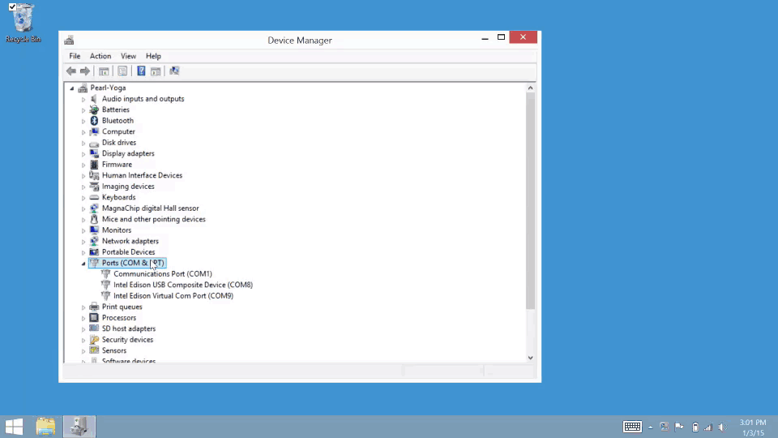
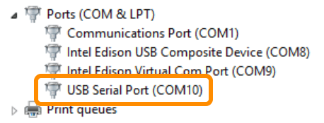

## Confirm installation of FTDI serial drivers

Look for "USB Serial Port" in Device Manager under “Ports (COM & LPT)” after plugging in the UART/serial USB cable.

---

1. _Power_ the Intel® Edison via the **device mode** micro-USB port and/or via the power barrel connector.

   or 

2. Connect a micro-USB cable to the **UART/serial** micro-USB port of the Intel® Edison expansion board, and the other end to your computer.

  

  Refer to [UART/serial micro-USB cable](/assembly/arduino_expansion_board/details-serial_cable.md) for more detailed cable connection information.

---

If you see "USB Serial Port" show up in Device Manager under "Ports (COM & LPT)", the drivers have been successfully installed. 

