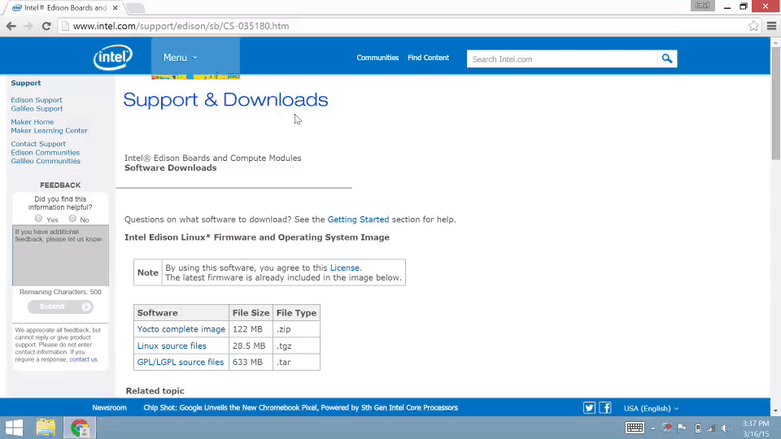
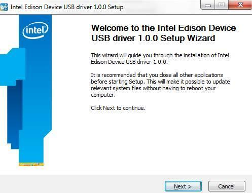

## Install Intel® Edison standalone drivers

The Windows standalone drivers for Intel® Edison include several USB drivers in one installer package. These drivers enable important features, such as:

* Composite Device Class (CDC) for programming the board via the Arduino IDE,
* Remote Network Driver Interface Spec (RNDIS) for Ethernet over USB, and
* Device Firmware Upgrade (DFU) for updating firmware on devices.

---

1. Get the latest Intel® Edison Device USB drivers for Windows installer.

    * On the USB key: downloads → Windows
    * Copy **IntelEdisonDriverSetup[version].exe** to your computer.

2. Double-click on the **IntelEdisonDriverSetup[version].exe** on your computer to begin installation. 

  

3. Follow the installation wizard. Click "**Next**" where needed. The default settings can be adjusted to your needs if required but you may wish to leave the defaults as is. 

4. Click "**Finish**" to close the installation wizard.
