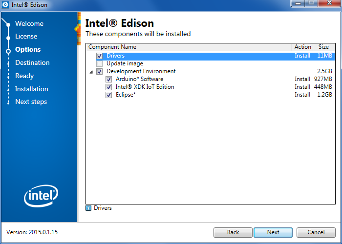

## Download and run the Intel® Edison integrated installer

The [Windows 64-bit Integrated Installer](https://software.intel.com/iot/hardware/edison/downloads) gives you options to automatically install:

* Intel® Edison and FTDI serial drivers on your Windows computer,
* an IDE of your choice (Arduino, Intel XDK® for IoT, and/or Eclipse), and
* the latest firmware image on your Intel® Edison.

---

1. Get the latest Intel® Edison 64-bit Windows installer.
  
  **Hackathon attendees:**

  1. On the USB key: files → Windows
  2. Copy **iotdk_win_installer.exe** to your computer.

  **Online option:**

  1. Visit the Intel® Edison Software Downloads page: [http://software.intel.com/iot/hardware/edison/downloads](https://software.intel.com/iot/hardware/edison/downloads).
  2. Scroll down to the "**Driver software**" section. 
  3. Click the "**Windows 64-bit Integrated Installer**" link to download **iotdk_win_installer.exe** to your computer

2. Connect a micro-USB cable to the **device mode** micro-USB port of the Intel® Edison expansion board, and the other end to your computer.

  

  Refer to [Device mode micro-USB cable](/assembly/arduino_expansion_board/details-device_mode_cable.md) for more detailed cable connection information.

3. Double-click on the **iotdk_win_installer.exe** on your computer to begin installation. 

  

4. Follow the installation wizard. Click "**Next**" where needed. 

5. When done, click "**Finish**" to close the installation wizard. 

  If there are any errors during installation, you will need to resolve them manually.

  ---

  **Is the "Next" button greyed out?**

  The integrated installer is unable to detect your Intel® Edison. Ensure that the board is powered on and plugged into your computer via the device mode micro-USB port on the expansion board.

  Otherwise you will need to install the Windows drivers manually. Go to [Set Up Your Computer - Windows (manual installation) »](manual_installation.md) 

  ---

---

The default settings can be adjusted to your needs, or leave the defaults as is. 

In the component selection screen, check the options you would like to install:

  * **Drivers:** 
  
    Installs the Intel® Edison drivers and FTDI serial drivers for Windows.

  * **Update image:** 
  
    Flashes the latest firmware image directly on your Intel® Edison.
    
    (Note: You will not be able to use this option until after you have installed the drivers. Re-run the integrated installer if you wish to use it to flash Intel® Edison firmware.)

  * **Development Environment:** Choose from 

      * **Arduino Software** (simplified C++), 

      * **Intel® XDK IoT Edition** (JavaScript), and/or 

      * **Eclipse** (C/C++).
