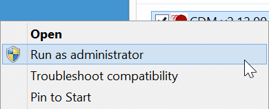
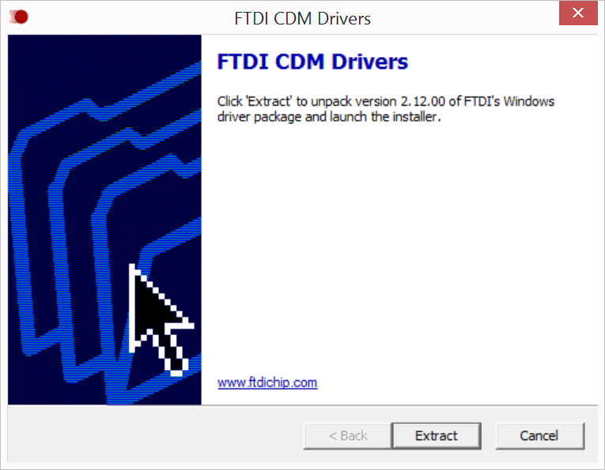

# Set Up Your Computer - Windows (manual installion)

_Instructions for the **Intel® Edison** on **Windows 32-bit or 64-bit**_

This setup document will guide you through manually preparing your computer with any Windows-specific software or drivers required for Intel® Edison development. 

---

**Are you running 64-bit Windows and have a good internet connection?**

For a more streamlined setup process, try the integrated program installer. Refer to [Set Up Your Computer - Windows (64-bit integrated installer) »](64bit_integrated_installer.md). 

---

**Table of contents**

* [Install Intel® Edison drivers »](#install-intel-edison-drivers)
* [Install FTDI serial drivers »](#install-ftdi-serial-drivers)
* [Restart your computer »](#restart-your-computer)

**Related videos**

[Intel Edison: Set Up Your Computer Manually - Windows (preview video)]()

## Install Intel® Edison drivers

The Intel® Edison drivers for Windows include several USB drivers in one installer package. These drivers enable important features, such as:

* Composite Device Class (CDC) for programming the board via the Arduino IDE,
* Remote Network Driver Interface Spec (RNDIS) for Ethernet over USB, and
* Device Firmware Upgrade (DFU) for updating firmware on devices.

1. Get the latest Intel® Edison Device USB drivers for Windows installer.

	* **Online option:**

		1. Visit the Intel® Edison Software Downloads page: [software.intel.com/iot/hardware/edison/downloads](https://software.intel.com/iot/hardware/edison/downloads).
		2. Scroll down to the "**Driver software**" section. 
		3. Click the "**Windows Standalone Driver**" link to download  _IntelEdisonDriverSetup[version].exe_ to your computer.
	
	* **Hackathon attendees:**
	
		1. On the USB key:  files →  Windows
		2. Copy   _IntelEdisonDriverSetup[version].exe_ to your computer.

	
2. Double-click on the  _IntelEdisonDriverSetup[version].exe_ on your computer to begin installation. 

	

3. Follow the installation wizard. Click "**Next**" where needed. The default settings can be adjusted to your needs if required but you may wish to leave the defaults as is. 

4. Click "**Finish**" to close the installation wizard.

## Install FTDI serial drivers

FTDI CDM drivers allow your computer to communicate with USB serial devices, including the Intel® Edison.

---

**Do you already have FTDI CDM drivers installed?**

If you have done Arduino development on your current computer before, you may already have the FTDI CDM drivers installed. Refer to Confirm installation of FTDI serial drivers to see if you need to skip over this step.

However, if you see a "New Hardware Found" message when you plug in the Intel® Edison via the UART/serial micro-USB port and the automatic device driver installation fails, you will need to install the FTDI drivers. Ignore Windows' request to install the drivers for you and follow the steps below. 

---
 
1. Get the latest FTDI CDM driver installer.

	* **Online option:**
		1. Visit [ftdichip.com/Drivers/D2XX.htm](http://ftdichip.com/Drivers/D2XX.htm).
		2. Scroll down to the "**Currently Supported D2XX Drivers**" table. 
		3. In the row for "**Windows***", click the "**setup executable**" link to download  _CDM [version] WHQL Certified.exe_ to your computer.
		
	* **Hackathon attendees:**
		1. On the USB key:  files →  Windows
		2. Copy  _CDM [version] WHQL Certified.exe_ to your computer.

2. Right-click on  *CDM [version] WHQL Certified.exe***. **Select "**Run as administrator**".

	

3. Click "**Extract**" to start the installation process. 

	

4. Follow the installation wizard prompts. Click "**Next**" where needed.

5. Click "**Finish**" to close the installation wizard.

## Restart your computer

To ensure driver installation changes take effect, reboot your Windows computer at this point.

1. Based on your version of Windows, select the option to fully shut down and restart your computer.

	

---

### Next Steps

[Confirm driver installation »](confirm_drivers.md)

