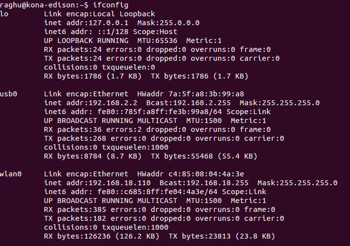

## Forward usb0 connection

Use Terminal and the `ifconfig` command to forward connections to the IP address 192.168.2.2 through "usb0" which should be the USB cable.

---

1. Open a new Terminal window.

2. Make sure your IoT board has the microswitch set to **device mode** and plug in the **device mode micro-USB cable** from your Intel® Edison to your computer. 

  Wait one minute for the Intel® Edison to finish booting up.

  

  _Refer to [Device mode micro-USB cable](/assembly/arduino_expansion_board/details-device_mode_cable.md) for full assembly instructions._

3. Use the `ifconfig` command to forward connections to the IP address "192.168.2.2" through "usb0" which should be the USB cable. You may be prompted for your user password.

  ```
  sudo ifconfig usb0 192.168.2.2
  ```

  ---

  **Can't see usb0?**

  Try this command first: 

  ```
  sudo ifconfig usb0 up
  ```

  ---

---

If you type the `ipconfig` command, you should see "192.168.2.2" for the usb0 entry:



See [Once connected...](/connectivity/ethernet_over_usb/shared/once_connected.md) for what you can do now.

---