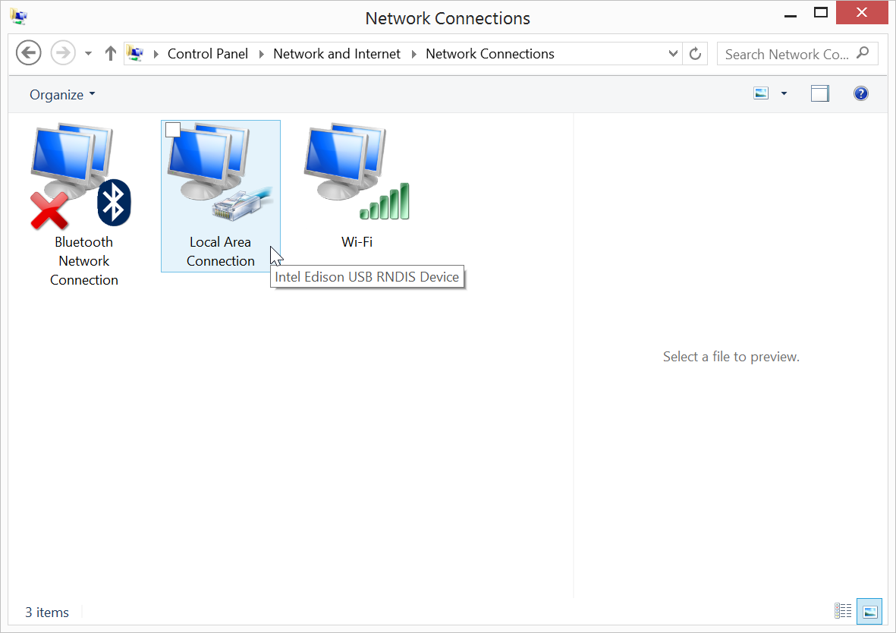
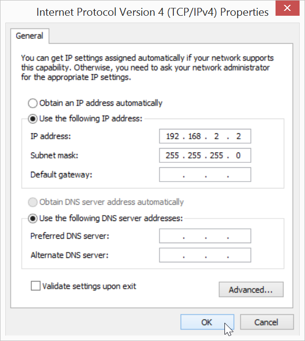
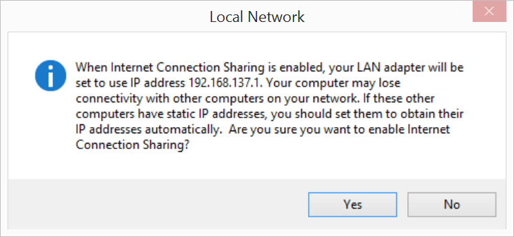

## Set Up Ethernet over USB - Windows

When you are in a busy or restricted network environment, connect to the Intel® Edison using the device mode micro-USB cable and a virtual Ethernet connection known as "Ethernet over USB". Ethernet over USB uses the RNDIS protocol.

This document will guide you through obtaining an IP address for the Intel® Edison in order to program your board offline using the Intel® IoT Developer Kit IDEs.


**Table of contents**

* [Add static IPv4 address »](#add-static-ipv4-address)
* [Share your computer's WiFi connection (optional) »](#share-your-computers-wifi-connection-optional)


**Related videos**

[Ethernet over USB - Intel Edison - Windows (preview)](https://drive.google.com/open?id=0B2ywC78pxngCUWJxZXJiYngycU0&authuser=0)


## Add static IPv4 address

If you have the Intel® Edison Drivers installed, update your computer's Network Adapter configuration with a static IP address to use Ethernet over USB.

---

**Have you installed the Intel® Edison Drivers?**

If you have not followed [Set Up Your Computer - Windows (64-bit integrated installer)](/computer_setup/windows/64bit_integrated_installer.md) or [Set Up Your Computer - Windows (manual installation)](/computer_setup/windows/manual_installation.md), please do so now. RNDIS drivers are included with the Intel® Edison Drivers.

---

1. View your **Network Connections**.

  * **Windows 8**: 
    1. Right-click on the Start menu button.
    2. Select "**Network Connections**".

  * **Windows 7 and below**: 
    1. Go to the Windows Control Panel. 
    2. Under "**Network and Internet**", click "**View network status and tasks**".

       

    3. Click "**Change Adapter Settings**" in sidebar.

      

2. Make sure your IoT board has the microswitch set to **device mode** and plug in the **device mode micro-USB cable** from your Intel® Edison to your computer. 

  Wait one minute for the Intel® Edison to finish booting up.

  

  _Refer to [Device mode micro-USB cable](/assembly/arduino_expansion_board/details-device_mode_cable.md) for full assembly instructions._

3. **Right-click** on the "**Local Area Connection**" network adapter entry with the label "**Intel Edison USB RNDIS Device**", then select "**Properties**".

  

  

4. In the new "Local Area Connection Properties" window, select "**Internet Protocol Version 4 (TCP/IPv4)**" from the list, then click "**Properties**".

  

5. In the new dialog window, select "**Use the following IP address**" and change the IP information as follows:

  * **IP address**: 192.168.2.2

  * **Subnet m****ask**: 255.255.255.0 (default)

  

6. Click "OK" to apply your changes and close the IPv4 properties window. 

  ---

  **IP address taken?**

  If you get a system notification that 192.168.2.2 is taken, try any IP address within the ranges of 192.168.2.1 to 192.168.2.14. 

  Do ***not*** use 192.168.2.15 which is already reserved for the USB Gadget network interface.

  ---

7. Click "Close" in any remaining network dialog windows that are open.

---

There is no noticeable difference to the "Local Area Connection" adapter icon. See [Once connected...](once_connected.md) to confirm a successful connection to the Intel® Edison.

---

## Share your computer's WiFi connection (optional)

Turn on Internet Connection Sharing (ICS) to cut down on Wi-Fi traffic in a crowded room. Sharing your computer's internet connection also means that you can log into networks that have HTML password pages and then share the connection with the Intel® Edison.

Internet sharing is an optional step but is highly recommended if you are at a hackathon.

1. Open your **Network Connections** again.

2. **Right-click** on the "**Wi-Fi**" network adapter entry, then select "**Properties**".

  

3. Select the "**Sharing**" tab. 

4. Check "**Allow other network users to connect through this computer’s Internet connection**" to enable Internet Connection Sharing (ICS).

  

5. Click "**Ok**". 

6. You will receive an alert about enabling ICS. Click "**Yes**" to continue.

  

---

Enabling ICS may have changed the IPv4 LAN settings you set in the previous section. Follow the steps in [Add static IPv4 address](#add-static-ipv4-address) to confirm that "Use the following IP address" is still set to "192.168.2.2".

---

7. Unplug and replug the device mode micro-USB cable to reset the Ethernet over USB connection.

8. Use PuTTY to establish a serial connection to the Intel® Edison.
  
  _Don't know how? Refer to [Shell Access](/shell_access/windows/serial_connection.md)._

9. On your Intel® Edison, disconnect from any WiFi networks the board might be logged into using the wireless command line interface (`wpa_cli`) command:

  ```
  wpa_cli disconnect
  ```

10. Then use the `route` command to add a default gateway. Use the same static IPv4 address you set in the **Network Connections** LAN settings in the previous section.

  ```
  route add default gw 192.168.2.2
  ```
  
---

You can now use the Intel® Edison as if it is connected to the internet on its own as long as you keep the device mode micro-USB cable plugged in.

Try pinging a network from PuTTY to make sure the Intel® Edison is connected to the internet through your computer's network connection:

```
ping google.com
```

(Use the Ctrl+C keyboard command to exit the ping process.)

To re-enable WiFi on the Intel® Edison, use the `configure_edison --wifi` command as described in [Connect Your Intel Edison to Wi-Fi](/connectivity/wifi/connect.md).

---

### Troubleshooting 

Unable to ping anything from the Intel® Edison?

* Unplug and replug the device mode micro-USB cable to reset the Ethernet over USB connection.
* Turn your computer's WiFi connections off, then back on.
* Restart your computer.
* Check that the IP address set in the IPv4 LAN settings is "192.168.2.2"

---

### Additional Resources

See what you can do [once connected »](once_connected.md)

---

### Next Steps

Based on your programming language preference, install an IDE for Intel® IoT development:

* **For C/C++:**
  * [Set Up IoT Dev Kit Eclipse »](/ide_setup-eclipse/setup.md)

* **For JavaScript:**
  * [Set Up Intel XDK for IoT »](/ide_setup-xdk/setup.md)


