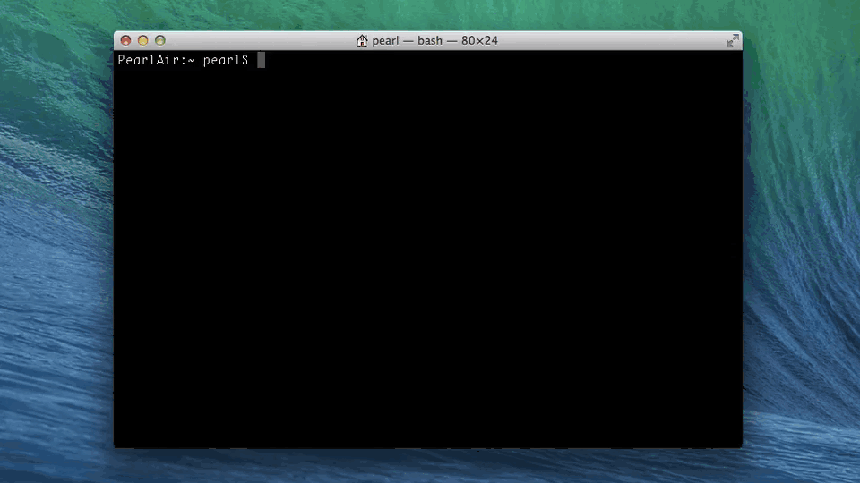
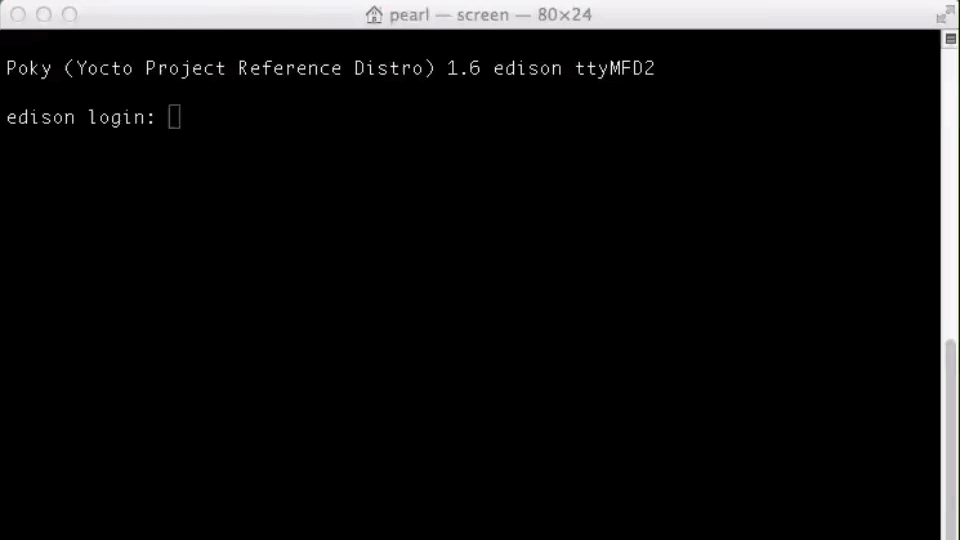

## Connect Your Intel Edison to Wi-Fi

The Intel® Edison has built-in Wi-Fi that you can turn on by logging into your board and enabling. This setup document will guide you through connecting the Intel® Edison board to the Internet using Wi-Fi.

Once your board is online, turn your Intel® Edison into a true "Internet of Things" device. You will also need the IP address of your Intel® board to program it using the Intel® IoT Developer Kit IDEs.

**Table of contents**

* [Connect to a Wi-Fi network »](#connect-to-a-wi-fi-network)
* [Identify the IP address »](#identify-the-ip-address)

**Related videos**

[Get Your Intel Edison Online (preview)](https://drive.google.com/open?id=0B2ywC78pxngCS2c3TndOT2EtT0k&authuser=0)

---

**What network is your computer using?**

To avoid any issues with firewalls and proxies, the IoT board and your computer should be on the same internet network. 

Note: Many larger companies have strict internet security policies and restrict direct IP address access of computers and devices that are on the same internal network. 

---

## Connect to a Wi-Fi network

Shell into your Intel® Edison and run the `configure_edison --wifi` command. Choose a Wi-Fi network to connect to, then input any login credentials for that network. [View detailed instructions »](details-configure_edison_wifi.md)

## Identify the IP address

Once your Intel® Edison is online, identify the IP address using the `configure_edison --showWiFiIP` or `ip a` commands in order to: manually add an IP to an Intel® IoT Developer Kit IDE, use with SSH clients, or use your IoT device as a web server. [View detailed instructions »](details-identify_ip.md)

  
---

### Next Steps

Based on your programming language preference, install an IDE for Intel® IoT development:

* **For C/C++:**
  * [Set Up IoT Dev Kit Eclipse »](/ide_setup/eclipse/)

* **For JavaScript:**
  * [Set Up Intel XDK for IoT »](/ide_setup/xdk/)
