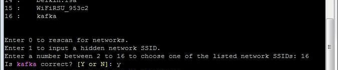
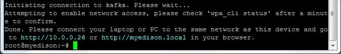

## Connect to a Wi-Fi network

Shell into your Intel® Edison and run the `configure_edison --wifi` command. Choose a Wi-Fi network to connect to, then input any login credentials for that network.


---

1. Establish a serial connection to the Intel® Edison.

  _Don't know how? Refer to [Shell Access](/shell_access/)._

2. Use the `configure_edison` command with the `--wifi` flag to start the wifi configuration process.

  ```
  configure_edison --wifi
  ```

  ---

  **Get a "configure_edison: not found" message?**
  
  You need to update your Edison firmware. Refer to [Flash Firmware Manually](/flash_firmware/manually.md) for instructions. 
  
  Or, if you are using Windows 64-bit, a streamlined firmware flashing process is included with the Windows 64-bit integrated installer. Refer to [Set Up Your Computer - Windows (64-bit integrated installer)](/computer_setup/windows/64bit_integrated_installer.md).

  ---

3. If you are asked if you want to set up the wifi, type "**Y**" and press Enter. (This prompt will occur on older Intel® Edison firmware only.)

4. The Intel® Edison will scan for Wi-Fi networks and display a list of available networks when finished.

  

  If you do not see any networks, but you know they exist, try re-scanning by entering "0", or repeat steps 2-3.

5. Locate the network you would like to connect to in the list and enter the **corresponding number** in the prompt. Press Enter. 

  To confirm your entry, type "**Y**" and press Enter.

  

  In this example, to connect to "kafka" use the number “16”.

6. The network in this example requires a password. Your network might require other information. Enter the appropriate network credentials. Press Enter when finished. 

  

7. The Intel® Edison will attempt to make a connection to the network.

---

When you see a "Done" message, you are now connected to a Wi-Fi network.



---

**Failed connection?**

If the connection fails, you may have typed in your credentials incorrectly.  Try again by typing in `configure_edison --wifi` and repeating the steps again.

If you cannot get online using Wi-Fi but need to program your board using the Intel® IoT Developer Kit IDEs, try [Ethernet over USB](/connectivity/ethernet_over_usb/) instead.

---