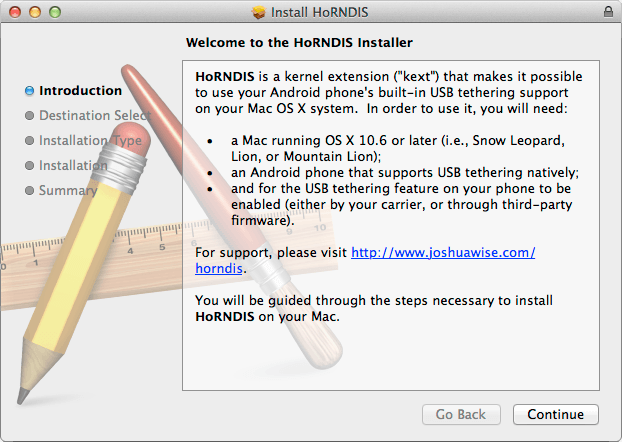
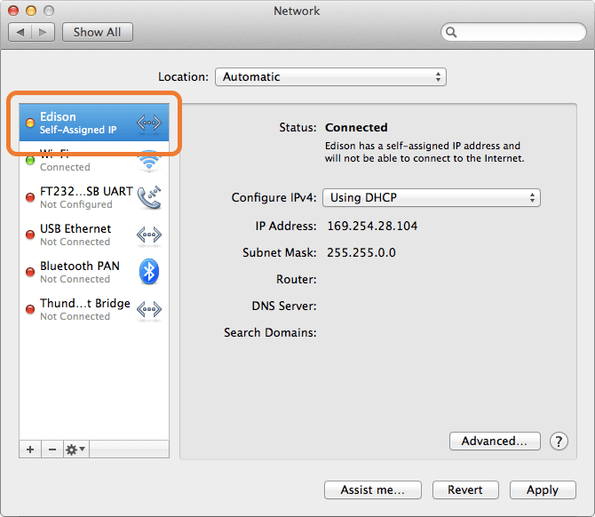

# Set Up Ethernet over USB - Mac

This document will guide you through obtaining an IP address for the Intel® Edison in order to program your board offline using the Intel® IoT Developer Kit IDEs.

When you are in a busy or restricted network environment, connect to the Intel® Edison using the device mode micro-USB cable and a virtual ethernet connection known as "Ethernet over USB". Ethernet over USB uses the RNDIS protocol.

---

**Do not use this guide if you are on Mac OS 10.10 (Yosemite)**

This process has been found to crash computers running Yosemite. Please proceed with caution and only use Ethernet over USB if you are on 10.9 (Mavericks) or lower.

If you are on Mac 10.10, instead follow [Connect Your Intel Edison to Wi-Fi »](../connect_to_wifi/connect.md)

---


**Table of contents**

* [Install HoRNDIS](#install-horndis)
* [Configure network settings](#configure-network-settings)
* [Share your computer's WiFi connection (optional)](#share-your-computers-wifi-connection-optional)


**Related videos**

[Ethernet over USB - Intel Edison - Mac (preview)]()


---

**Are you using the device mode micro-USB cable?**

In order to use Ethernet over USB, your Intel® Edison must have the microswitch set to device mode and the appropriate micro-USB cable plugged in. Refer to [Connecting Cables → Device mode micro-USB cable](../assembly-arduino_expansion_board/connecting_cables.md#device-mode-micro-usb-cable) for full assembly instructions.

---

## Install HoRNDIS

Install the HoRNDIS (pronounced "horrendous") kernel extension to use Ethernet over USB via the RNDIS protocol on your Mac. You must reboot your computer after installing HoRNDIS.

1. Get the latest version of HoRNDIS. Visit [http://joshuawise.com/horndis#available_versions](http://joshuawise.com/horndis#available_versions) and click on the "**HoRNDIS-rel[version].pkg (bytes)**" link for the latest version.

2. Double-click on the downloaded *HoRNDIS-rel[version].pkg* to start the installation wizard.

	

3. Follow the installation wizard prompts. Click "**Next**" where needed.

4. Once you have finished with the installation wizard, **you must restart your Mac** for the changes to take affect.


## Configure network settings

1. Open your **Network** preference settings.

	(i.e. In the OS X menu bar, choose  → System Preferences → Network)

2. Plug in the device mode micro-USB cable from your Intel® Edison to your computer. 

	Wait one minute for the Intel® Edison to finish booting up.

3. You should see an "**Edison**" entry (or "Multifunction Composite Gadget" if your Intel® Edison firmware is old) with a yellow dot status show up in the Network settings side panel on the left. 

	Select the "Edison" entry.

	

4. For "Configure IPv4", from the drop down choose "**Using DHCP with manual address**".

	 

5. Change "IP Address" to be "**192.168.2.2**".

	

	Keep "Subnet Mask" at default "255.255.255.0".

6. Click "**Apply**". 

---

You should see the yellow status dot turn green. 

See [Once connected...](once_connected.md) for what you can do now.

---

---

**IP address taken?**

If you get a system notification that 192.168.2.2 is taken, try any IP address within the ranges of 192.168.2.1 to 192.168.2.14. 

Do not use 192.168.2.15 which is already reserved for the USB Gadget network interface.

---

If you are on Mavericks, you may see multiple numbered "Multifunction Composite Gadget" or "Edison" service entries show up each time you plug in the same Intel® Edison. It is safe to delete old ones when done.

If you select one of the duplicate entries and do not see a "Configure IPv4" drop down, keep looking for the correct service entry to configure.

---

## Share your computer's WiFi connection (optional)

Turn on Internet Sharing to cut down on Wi-Fi traffic in a crowded room. Sharing your computer's internet connection also means that you can log into networks that have HTML password pages and then share the connection with the Intel® Edison.
Internet sharing is an optional step but is highly recommended if you are at a hackathon.

1. Open your **Sharing** preference settings.
	(i.e. In the OS X menu bar, choose  → System Preferences → Sharing)

2. If "**Internet Sharing**" is currently checked in the lefthand services list, **uncheck it** in order to make changes to your Mac Sharing settings.

	

3. Select "**Wi-Fi**" from the "**Share your connection from**" dropdown list, if not already selected.

	

4. Check "**Edison**" under "**To computers using**".

	

5. Enable sharing by checking "**Internet Sharing**" in the lefthand services list.

6. You will see a warning. Click "**Start**" to continue.

	

7. Unplug and replug the device mode micro-USB cable to reset the Ethernet over USB connection.

8. Use Terminal to establish a serial connection to the Intel® Edison.

	_Don't know how? Refer to [Shell Access](../shell_access/mac/serial_connection.md)._

9. On your Intel® Edison, disconnect from any WiFi networks the board might be logged into using the wireless command line interface ("wpa_cli") command:

	```
	wpa_cli disconnect
	```

10. Then use the "route" command to add a default gateway. Use the same static IP address you set in the **Network** settings in the previous section.

	```
	route add default gw 192.168.2.2
	```

---

You can now use the Intel® Edison as if it is connected to the internet on its own as long as you keep the device mode micro-USB cable plugged in.

Try pinging a network from Terminal to make sure the Intel® Edison is connected to the internet through your computer's network connection:

```
ping google.com
```

(Use the Ctrl+C keyboard command to exit the ping process.)

To re-enable WiFi on the Intel® Edison, use the `configure_edison --wifi` command as described in [Connect Your Intel Edison to Wi-Fi](../connect_to_wifi/connect.md).

---

**Unable to ping anything from the Intel® Edison?**

Unplug and replug the device mode micro-USB cable to reset the Ethernet over USB connection.

1. Turn your computer's WiFi connections off, then back on.
2. Restart your Windows computer.
3. Check that the IP address set in the IPv4 LAN settings is "192.168.2.2"

---

### Additional Resources

See what you can do [once connected »](once_connected.md)


### Next Steps

Based on your programming language preference, install an IDE for Intel® IoT development:

* **For C/C++:**
  * [Set Up IoT Dev Kit Eclipse »](../set_up_eclipse/setup.md)

* **For JavaScript:**
  * [Set Up Intel XDK for IoT »](../set_up_xdk/setup.md)


