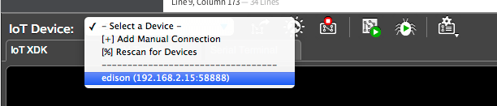

# Once connected...

This document will guide you through obtaining an IP address for the Intel® Edison in order to program your board offline using the Intel® IoT Developer Kit IDEs.

When you are in a busy or restricted network environment, connect to the Intel® Edison using the device mode micro-USB cable and a virtual ethernet connection known as "Ethernet over USB". Ethernet over USB uses the RNDIS protocol.

**Table of contents**

* [Ping or visit 192.168.2.15](#ping_or_visit_192168215)
* [Use SSH instead of a serial connection](#use-ssh-instead-of-a-serial-connection)
* [Program IoT board while offline](#program-iot-board-while-offline)

**Related videos**

[Ethernet over USB - Intel Edison - Windows (preview)]()


## Ping or visit 192.168.2.15

You can now ping your Intel® Edison board on address "**192.168.2.15"** from Command Prompt on your computer. Or visit [http://192.168.2.15](http://192.168.2.15) from your web browser.

```
ping 192.168.2.15
```

## Use SSH instead of a serial connection

Use PuTTY to wirelessly SSH into the Intel® Edison at "192.168.2.15" instead of using a wired serial connection. 

```
ssh root@192.168.2.15
```

(You can also continue to use `ssh root@edison.local` if your device is still named "edison".)

## Program IoT board while offline

The Intel® XDK IoT Edition IDE should automatically detect your Intel® Edison board. Select "192.168.2.15:58888" from the "IoT Device" drop down to upload your programs. 



---

Ethernet over USB device not showing up Intel® XDK?

Shell into your board and restart the XDK Daemon.

```
systemctl restart xdk-daemon
```

---

---

Return to:

* [Ethernet over USB - Windows »](windows.md)
* [Ethernet over USB - Mac »](mac.md)
* [Ethernet over USB - Linux »](linux.md)


