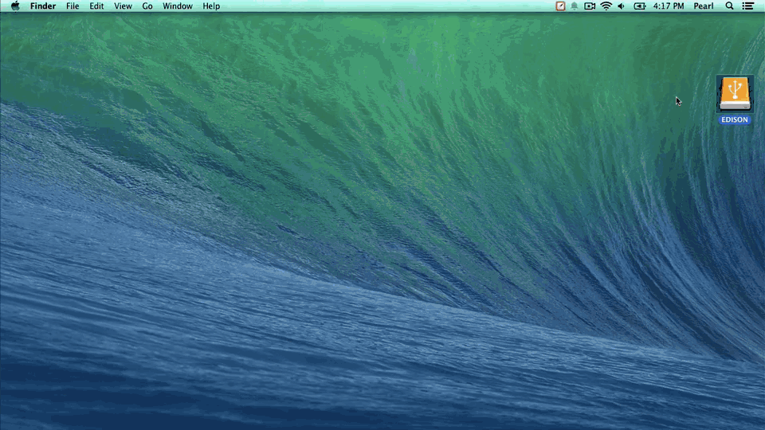

## Step 1: Prepare built-in flash storage (Mac)

Make sure there are no files on the built-in flash storage of the Intel® Edison by formatting the storage. The storage **must** be formatted as FAT32.

---

1. In order to read or write to the Intel® Edison's built-in flash storage, connect the Intel® Edison to your computer via the **device mode** micro-USB connector.

  

2. Use Disk Utility to format the flash storage drive. 

  **Option 1:**

  * Launch Spotlight (type Cmd+Space).
  * Type "disk". 
  * Select the "Disk Utility" app.

  **Option 2:**
  
  * Go to Applications on your Mac.
  * Open Utilities. 
  * Launch Disk Utility.app.

3. In the left hand sidebar of Disk Utility, select the "**Edison**" drive.

  

4. Select the "**Erase**" tab.

  

5. For "**Format**", make sure "**MS-DOS (FAT)**" is selected.

  

  ---
  
  The Intel® Edison will not flash properly if the memory is not formatted as FAT32. Make sure "MS-DOS (FAT)" is selected which is FAT32.
  
  ---

6. Click the "**Erase**" button.

  

7. In the popup, click "**Erase**" to confirm.

---

The Intel® Edison on-board storage memory should now be formatted as FAT32 and empty. 
