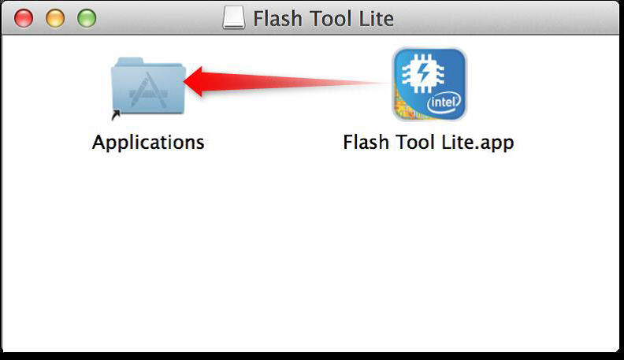

# Set up Flash Tool Lite for Mac OSX

This document explains the installation procedure Flash Tool Lite for Mac OSX. The tool is used to flash the firmware on Intel® Edison boards, but will expand to other IoT products in the future.

**Installation**

1. Copy the FlashToolLite.dmg from your USB drive in downloads -> Mac folder to your home directory.
2. Open FlashToolLite.dmg and drag Flash Tool Lite into the Application folder.

   
   
**Next Steps**

  * [Update firmware using the tool »](/flash_firmware/update_firmware.md)
