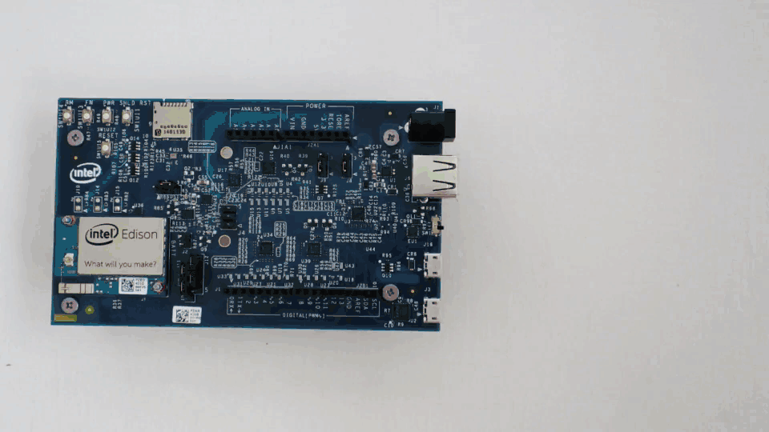
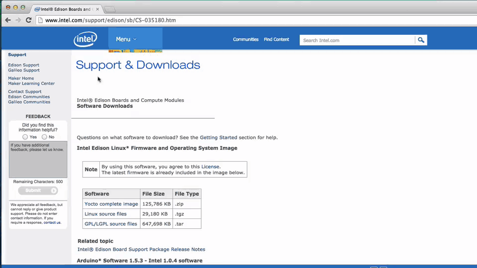
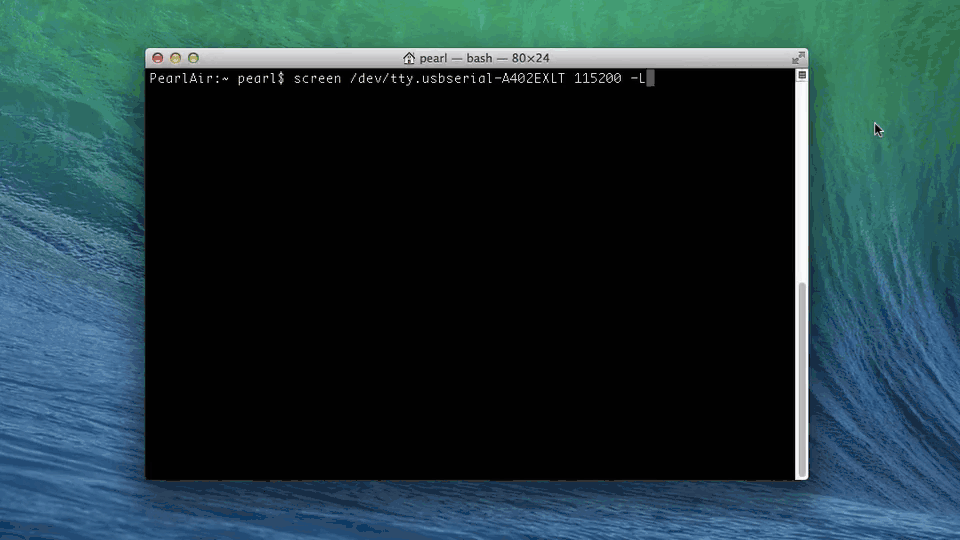

# Flash Firmware Manually

The firmware on your Intel® Edison is the board's operating system. Intel® IoT firmware engineers are constantly improving the performance of the Intel® Edison and enabling new features. When you receive a brand new Intel® Edison, update the firmware on the board to get the best developer experience.

This document will guide you through the manual process required to flash the firmware on the Intel® Edison using any OS platform.

There are 3 parts to updating the firmware on the Intel® Edison:

* [Step 1: Prepare built-in flash storage »](#step-1-prepare-built-in-flash-storage)
* [Step 2: Copy over the latest image »](#step-2-copy-over-the-latest-image)
* [Step 3: Flash the image »](#step-3-flash-the-image)
  
---

**Using a 64-bit Windows computer?**

A streamlined firmware flashing process is included with the Windows 64-bit integrated installer. Refer to [Set Up Your Computer - Windows (64-bit integrated installer)](/computer_setup/windows/64bit_integrated_installer.md) for more info.

---

**Want to know if your current firmware is old before flashing?**

Refer to [Check installed firmware version](check_firmware_version.md).

---

**Related videos**

[How to Flash Firmware Manually on the Intel® Edison (preview)](https://drive.google.com/open?id=0B2ywC78pxngCWkNUT3dkWklBdDg&authuser=0)

## Step 1: Prepare built-in flash storage

Make sure there are no files on the built-in flash storage of the Intel® Edison by formatting the storage. The storage **must** be formatted as FAT32.

* [View detailed instructions for Windows »](details-format_storage-windows.md)
* [View detailed instructions for Mac »](details-format_storage-mac.md)
* [View detailed instructions for Linux »](details-format_storage-linux.md)

## Step 2: Copy over the latest image

Extract the contents of the [Yocto complete image](http://software.intel.com/iot/hardware/edison/downloads) zip, then copy the contents to your Intel® Edison drive.

[View detailed instructions »](details-copy_image_files.md)

## Step 3: Flash the image

Run the `reboot ota` command on the Intel® Edison to flash the board with the files you copied over in Step 2.

[View detailed instructions »](details-reboot_ota.md)

### Next Steps

Get your board online in order to turn your IoT board into a true "Internet of Things" device. You also need the IP address of your IoT board to program it using the dev kit IDEs.

**At a hackathon? On a busy or restricted Wi-Fi network?**

Connect to the Intel® Edison using the device mode micro-USB cable and a virtual Ethernet connection known as "Ethernet over USB":

* [Windows »](/connectivity/ethernet_over_usb/windows/connect.md)
* [Linux »](/connectivity/ethernet_over_usb/linux/connect.md)
* Note: At this time, Ethernet over USB on [Mac](/connectivity/ethernet_over_usb/mac/connect.md) is not officially supported.

**At home? Have a dependable Wi-Fi connection?**

* [Get Your Edison Board Online »](/connectivity/wifi/connect.md)
