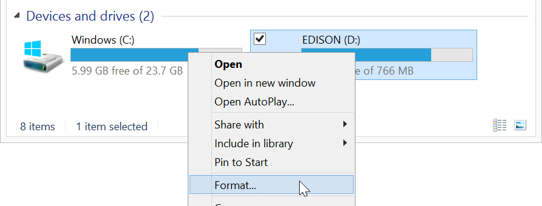
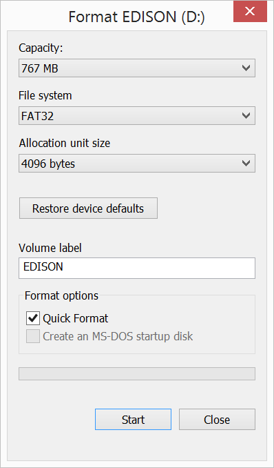
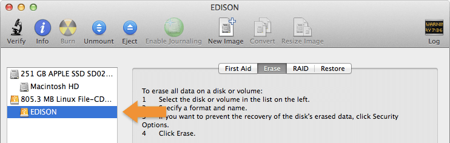
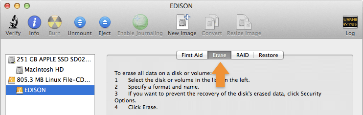
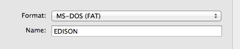
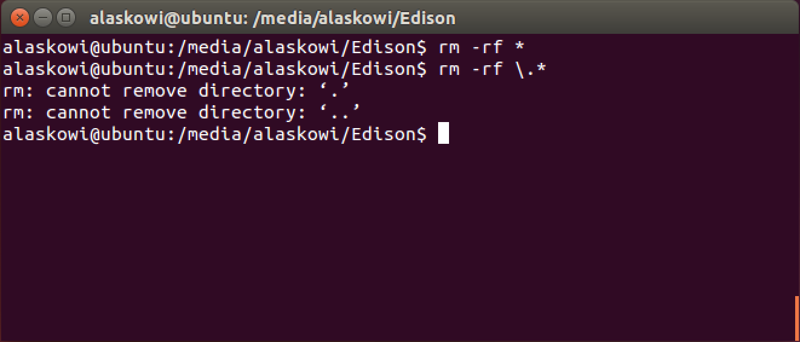
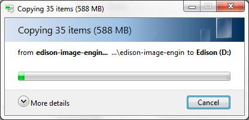
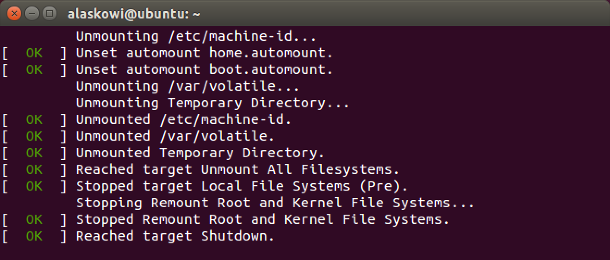
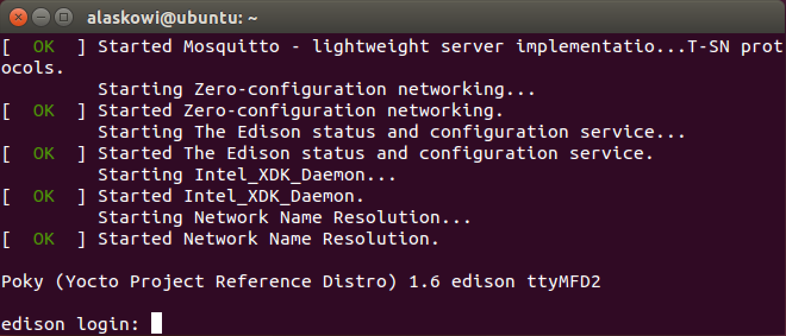

# Flash Firmware Manually

Instructions for the **Intel® Edison** on **all platforms**

The firmware on your Intel® Edison is the board's operating system. Intel® IoT firmware engineers are constantly improving the performance of the Intel® Edison and enabling new features. When you receive a brand new Intel® Edison, update the firmware on the board to get the best developer experience.

This document will guide you through the manual process required to flash the firmware on the Intel® Edison using any OS platform.</td>

There are 3 parts to updating the firmware on the Intel® Edison:

* Make sure there are no files on the built-in flash storage of the Intel® Edison.
* Download and copy the latest firmware image files to the board.
* Run "reboot ota" on the board.

---

**Using a 64-bit Windows computer?**

A streamlined firmware flashing process is included with the Windows 64-bit integrated installer. Refer to S[et Up Your Computer - Windows (64-bit integrated installer)](../set_up_your_computer-windows/64bit_integrated_installer.md) for more info.

**Want to know if your current firmware is old before flashing?**
Refer to [Check installed firmware version](check_firmware_version.md).

---

**Table of contents**

* [Step 1: Prepare built-in flash storage](#step-1-prepare-built-in-flash-storage)
	* [On Windows](#on-windows)
	* [On Mac](#on-mac)
	* [On Linux](#on-linux)
* [Step 2: Copy over the latest image](#step-2-copy-over-the-latest-image)
* [Step 3: Flash the image](#step-3-flash-the-image)


**Related videos**

[How to Flash Firmware Manually on the Intel® Edison (preview)]()


## Step 1: Prepare built-in flash storage

1. In order to read or write to the Intel® Edison's built-in flash storage, connect the Intel® Edison to your computer via the **device mode** micro-USB connector.

	

### On Windows

2. Use Windows File Explorer to format the flash storage drive. Right-click on the "**Edison**" drive that appears after plugging in the Intel® Edison to your computer, then select "Format".

	

3. In the "Format Edison" dialog window, keep the default settings. Click "Start".

	

4. In the popup, click "Ok" to confirm the formatting of the "Edison" drive. 
Formatting should only take a few seconds.

---

The "Edison" folder should now be empty. Continue to [Step 2: Copy over the latest image](#step-2-copy-over-the-latest-image).

---

### On Mac

1. Use Disk Utility to format the flash storage drive. 

	**Option 1:**

	* Launch Spotlight (type Cmd+Space).
	* Type "disk". 
	* Select the "Disk Utility" app.

	**Option 2:**
	
	* Go to Applications on your Mac.
	* Open Utilities. 
	* Launch Disk Utility.app.

1. In the left hand sidebar of Disk Utility, select the "**Edison**" drive.

	

2. Select the "**Erase**" tab.

	

3. For "**Format**", make sure "**MS-DOS (FAT)**" is selected.

	

	---
	
	The Intel® Edison will not flash properly if the memory is not formatted as FAT32. Make sure "MS-DOS (FAT)" is selected which is FAT32.
	
	---

4. Click the "**Erase**" button.

	

5. In the popup, click "**Erase**" to confirm.

---

The Intel® Edison on-board storage memory should now be formatted as FAT32 and empty. Continue to [Step 2: Copy over the latest image](#step-2-copy-over-the-latest-image).

---


### On Linux

1. Open up a new Terminal window.

2. Use the "cd" command to go into the "Edison" drive. 

	**Replace "[username]" with your actual username.**
	
	**note - use "/media/[username]/Edison" _not_ "/media/psf/Edison".**

	```
	cd /media/[username]/Edison
	```

3. Use the "rm" command to remove **all** visible and invisible files. 

	**Double-check and make sure you are in the Intel® Edison's drive!**

	```
	rm –rf *
	rm –rf \.*
	```

	

---

All files should now be removed. To confirm, use the "ls" command to list the files.

```
ls
```

Continue to [Step 2: Copy over the latest image](#step-2-copy-over-the-latest-image).

---


## Step 2: Copy over the latest image

Extract the contents of the compressed firmware image archive, then copy the contents to your Intel® Edison drive.

1. Get the latest Yocto firmware image for the Intel® Edison.

	**Online option:**
	
	1. Visit the Intel® Edison Software Downloads page: [software.intel.com/iot/hardware/edison/downloads](http://software.intel.com/iot/hardware/edison/downloads).
	2. Scroll down to the "Intel® Edison firmware and operating system image" section.
	3. Click "Yocto complete image" to download the latest edison-image-[version].zip to your computer.
		
	**Hackathon attendees:**
	
	1. On the USB key: files → Firmware - Edison Yocto complete image
	2. Copy edison-image-[version].zip to your computer.
		
	---

	**Interested in finding out what's new with each firmware release?**
	
	Visit [Intel® Edison Boards and Compute Modules — Support Package Release 	Notes]() to view the release notes PDF.

	---

2. Extract the contents of edison-image-[version].zip to your hard drive.

3. Copy the **entire contents** of the edison-image-[version] folder to the "Edison" drive that shows up after plugging the Intel® Edison to your computer. 

	Do **not** include the containing/parent edison-image-[version] folder; just the contents of the folder.

	

---

Your "Edison" drive should now look similar to this:


---


## Step 3: Flash the image

Run the "reboot ota" command on the Intel® Edison to flash the board with the files you copied over in Step 2.

1. Establish a serial connection to the Intel® Edison.

	_Don't know how? Refer to [Shell Access](../shell_access/)._

1. Use the "reboot ota" command to reboot the Intel® Edison from the command line.

	**Note:** This will erase everything on your Intel® Edison including configuration settings such as the board's username and password.

	```
    reboot ota
    ```

1. Your Intel® Edison will reboot and begin the flashing process with the latest image.

	

1. When the Intel® Edison is done flashing, you should see the login prompt.

	

---

If the firmware flash was successful, you should now be able to use the "configure_edison" command with the "--version" flag.

```
configure_edison --version
```

If the output is "120" (or higher, depending on how up to date this document is), you have successfully flashed your board! 

---

---

**No "configure_edison --version" option? Don't see "120" (or higher) outputted as the build version number?**

Your board was not updated with the latest image.

Incomplete zip downloads may cause issues. Re-download the "Yocto complete image" zip file from Intel® Edison Boards and Compute Modules - Software Downloads and try again from Step 1: Remove any old images.

Mac users only: If re-downloading a new zip does not fix the issues, you can try the "Alternate Flashing Method" described at the bottom of Intel Edison Flashing Firmware on OS X - Wired. 

---

### Next Steps

Get your board online in order to turn your IoT board into a true "Internet of Things" device. You also need the IP address of your IoT board to program it using the dev kit IDEs.

**At a hackathon? On a busy or restricted Wi-Fi network?**

Connect to the Intel® Edison using the device mode micro-USB cable and a virtual Ethernet connection known as "Ethernet over USB":

* [Windows »](../ethernet_over_usb/windows.md)
* [Linux »](../ethernet_over_usb/linux.md)
* Note: At this time, Ethernet over USB on [Mac](../ethernet_over_usb/mac.md) is not officially supported.

**At home? Have a dependable Wi-Fi connection?**

* [Get Your Edison Board Online »](../connect_to_wifi/connect.md)
