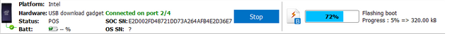

# Flash the Edison

To start this process, do not have the Edison board plugged in on USB or powered on with a power supply.

1. Copy the edison-image-ww25.5-15.zip from the USB drive in *downloads -> Firmware - Edison Yocto complete image* directory to your home directory.
2. Launch Flash Tool Lite, click browse and select edison-image-ww25.5-15.zip file.
 
   

3. The tool extracts the zip file and loads FlashEdison.json.
 
   

4. On the Configuration drop down, **choose CDC if your host machine is OS X or Linux**, **choose RNDIS for Windows**.
5. Click Start to Flash (the Edison board is not yet plugged in).
 
   

6. Plug the USB cable into the Multigadget port of the Edison board. You should see the Flash Tool detect the board and begin the flash process.

   

**Firmware flash progress**

   
   
   

