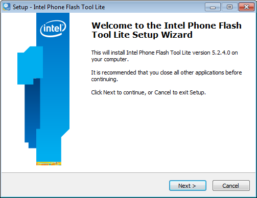
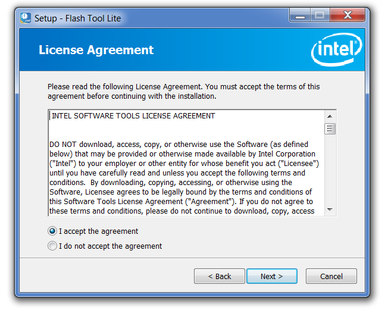
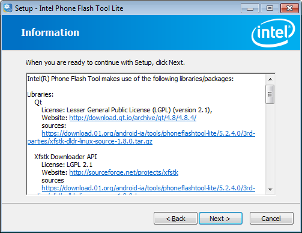
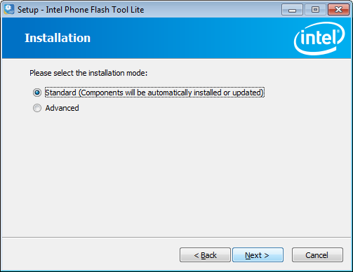
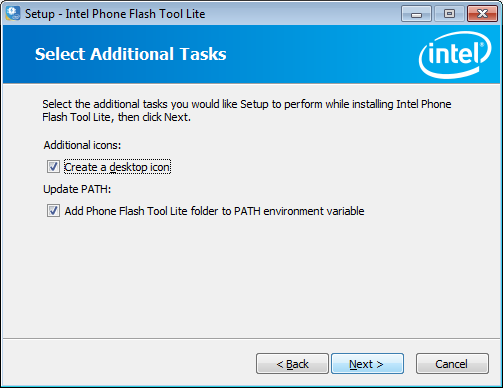
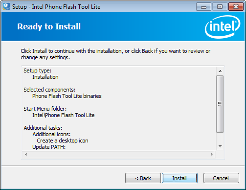

# Set up Flash Tool Lite for Windows*

This document explains the installation procedure Flash Tool Lite for Windows*. The tool is used to flash the firmware on Intel® Edison boards, but will expand to other IoT products in the future

**Installation**

1. Copy the PhoneFlashToolLite_5.2.4.0_win32.exe from your USB drive in downloads -> Windows folder to your home directory.
2. Run the installer and click *Next*.
  
   

3. Accept the License agreement, click *Next*.

   
   
4. Click next after screen documenting libraries and packages.

   
   
5. Select *Standard* installation. 

   
   
6. Retain the selections, click *Next*.

   
   
7. Click *Install* to complete.

   
   
   *A driver install may be specified after completion of the main wizard, answer yes and complete that install.
   
   
   
