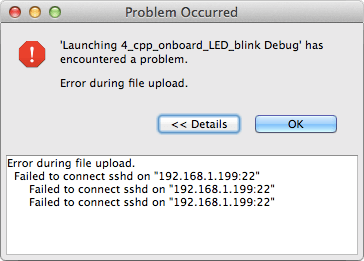

## Build and run a sample application

The version of Eclipse distributed with the developer kit has some example projects already built in. To start, build a blinking LED project from a pre-existing sample.

---

1. If not already selected, click the "**C/C++**" tab in the top right corner of the Eclipse screen.

  

2. From the "**Project Explorer**" panel on the left side, right-click on "**4_cpp_onboard_LED_blink**". 

  

3. Then select "**Build Project**" in the context menu.

  

4. Wait for the project to finish building for the first time. A message will be displayed in the "Console" panel at the bottom of the Eclipse IDE when done.

  

5. From the toolbar at the top of the Eclipse IDE, **click the little arrow to the _right_ of the Run icon** to open the Run drop down menu.

  

6. Select "**4_cpp_onboard_LED_blink Debug**". Note the "Debug" at the end of the project name.

  

  *The application list order moves around so "4_cpp_onboard_LED_blink Debug" may appear anywhere in the drop down list. Look carefully.*

7. A password dialog will appear. If you have not configured your board with a different user ID and password, enter "root" for the "User ID" and leave the "Password" field empty. Click "**OK**" when done.

  

  ---

  **Intel® Edison only: Do you get a "Failed to connect sshd" error message?**

  

  If your Intel® Edison is using a WiFi connection, you must have a password set on your board otherwise you will get a SSH connection error. To set a password, connect to your Intel® Edison via a serial connection and run:

  ```
  configure_edison --password
  ```

  ---

7. The following authentication warning will appear. Click "**Yes"** to proceed. You should only see this warning once.

  

8. Your compiled project code will be transferred over to the Intel® Edison's or Intel® Galileo's onboard memory and run. 

  Look in the "Console" panel for any program messages.

  
