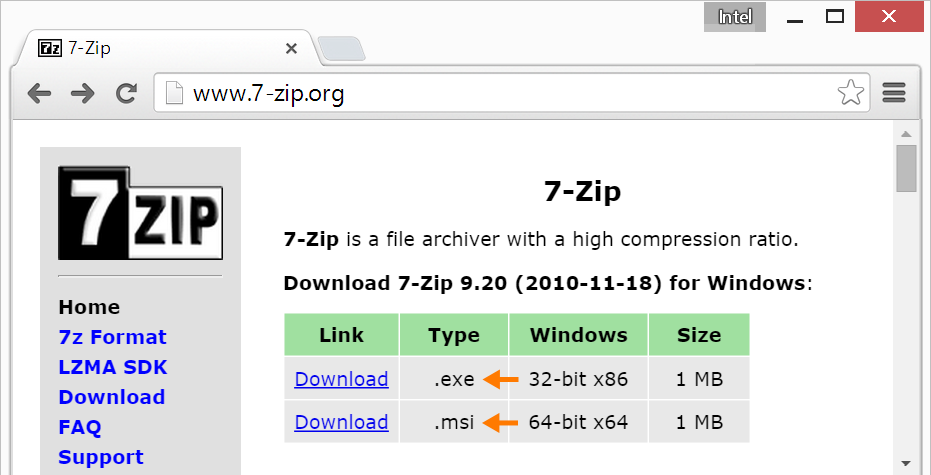
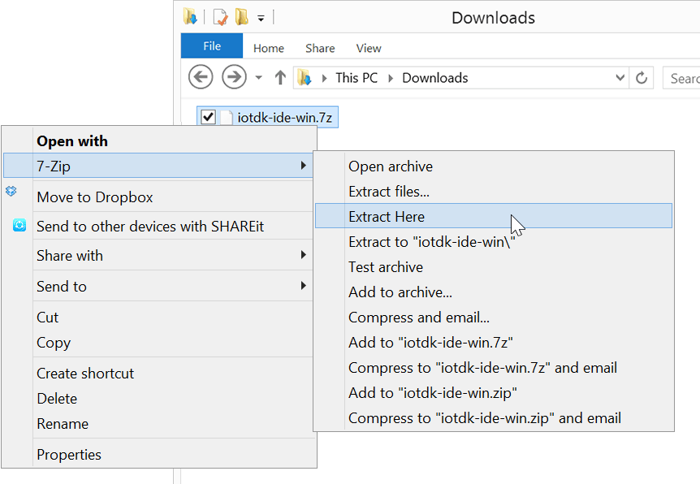
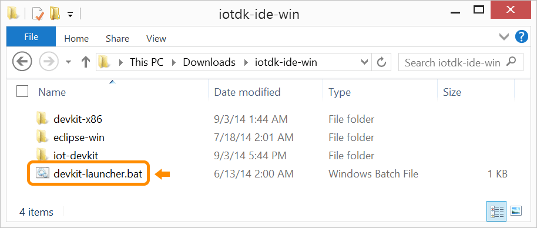
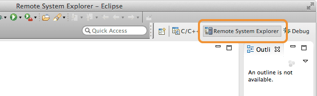
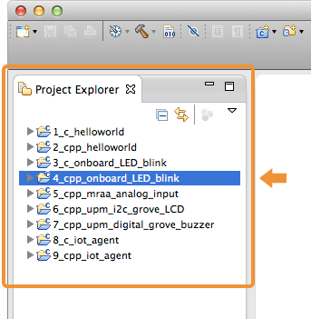

# Set Up Intel® IoT Dev Kit Eclipse 

The Intel® IoT Developer Kit ("dev kit") lets you create and test applications on Intel® IoT platforms. The Eclipse IDE distributed with the dev kit facilitates writing IoT applications in C and C++.

This document will guide you through installing the Eclipse IDE distributed with the Intel® IoT Developer Kit, along with compiling and running a Hello Word project (blinking the onboard LED) on either the Intel® Galileo or the Intel® Edison.

---

**Using a 64-bit Windows computer?**

Intel® XDK IoT Edition can be installed via the Windows 64-bit integrated installer. Refer to [Set Up Your Computer - Windows (64-bit integrated installer)](../computer_setup/windows/64bit_integrated_installer.md) for more info.

---

**Table of contents**

* [Step 1: Install prerequisite software](#step-1-install-prerequisite-software)
  * [Install 7Zip - Windows only](#install-7zip---windows-only)
  * [Install Java](#install-java)
* [Step 2: Install Intel® IoT dev kit Eclipse IDE](#step-2-install-intel-iot-dev-kit-eclipse-ide)
* [Step 3: Launch Eclipse using batch file](#step-3-launch-eclipse-using-batch-file)
* [Step 4: Run a sample project](#step-4-run-a-sample-project)
  * [Select a target IoT device](#select-a-target-iot-device)
  * [Build and run a sample application](#build-and-run-a-sample-application)


**Related videos**

* [Set Up Intel IoT Dev Kit Eclipse – Part 1: Installation]()
* [Set Up Intel IoT Dev Kit Eclipse – Part 2: Run a Sample Project]()


## Step 1: Install prerequisite software

Depending on your computer's operating system, you may need to install additional software in order to use the dev kit version of Eclipse.

### Install 7Zip - Windows only

1. Download the **7-Zip** installer software from [7-zip.org](http://www.7-zip.org).

  
  
  *Based on whether your Windows is 32-bit or 64-bit, download either the .msi or .exe version.*

2. Double-click on the downloaded .exe or .msi to launch the 7zip installer.

3. Follow the instructions in the installation wizard, clicking "Next" where needed.

  

### Install Java

Eclipse depends on either a Java Runtime Engine (JRE) or Java Development Kit (JDK). Check if you have Java installed and, if you do not, install it.

**On Windows**

If you do not know if you have Java installed, refer to [How can I find which version of Java is installed without running an applet in Windows or Mac?](https://www.java.com/en/download/help/version_manual.xml) on java.com for instructions.

1. Download the Oracle distribution of a Java JRE or JDK from [oracle.com/technetwork/java/javase/downloads/index.html](http://www.oracle.com/technetwork/java/javase/downloads/index.html).

**On Mac**

A Java runtime ships with the Mac operating system however, if you are running OS X 10.9.4 or older, you may need to update your version of Java.

1. If needed, download the Oracle distribution of Java for Mac from [java.com/en/download/mac_download.jsp](https://www.java.com/en/download/mac_download.jsp).

**On Linux**

1. Check if you have Java installed.

    1. Open a Terminal window.

    2. Type:

    ```
    java
    ```
    
    If you see a "The program ‘java’ can not be found" message, you do not have Java installed and you will need to install it.

2. Install a Java runtime using the `apt-get` command. You may need to enter your user password.

  ```
  sudo apt-get install default.jre
  ```

## Step 2: Install Intel® IoT dev kit Eclipse IDE

Get the latest Eclipse IDE for Intel® IoT development. Download the compressed archive containing the customized IDE and extract the contents to your computer. If more detail is needed, platform-specific instructions are below.

1. Get the latest IoT dev kit Eclipse IDE package.

  **Online option:**

  1. Visit [software.intel.com/en-us/iot/downloads](http://software.intel.com/en-us/iot/downloads). 
  2. Scroll down to "Dev Environment Download Options for Galileo and Edison".
  3. Ensure that your OS platform is selected in the drop down list, then click "Download" to start downloading the IDE package.

  **Hackathon attendees:**

  1. On the USB key: files → [your OS]
  2. Copy the appropriate iotdk-ide file to your computer:
    * **Windows**: iotdk-ide-win.7z
    * **Mac**: iotdk-ide-mac.tar.bz2 
    * **Linux**: iotdk-ide-linux.tar.bz2


**On Windows**

1. Use 7zip to extract the archive: 

  ---

  **Use 7Zip only. Do not use any other Windows file archiver utility.**

  7zip supports extended file paths which some of the contents of the compressed file have so only use 7zip software to extract the file. 

  ---

  1. **Right-clic****k** on iotdk-ide-win.7z.

  2. Select "**7zip**", then "**Extract here**". 

    

2. Wait for the extraction process to finish. It will take a a few minutes.

**On Mac**

1. Double-click iotdk-ide-mac.tar.bz2 to extract the contents of the archive.

  

**On Linux**

1. Extract the contents of iotdk-ide-linux.tar.bz2.

  1. Open a new Terminal window.

  2. `cd` into the directory that contains the .bz2. 

    e.g. If you copied the file to your desktop: `cd ~/Desktop/`

  3. Type `tar -jxvf iotdk-ide-linux.tar.bz2` to extract the tar.bz2. The process will take a a few minutes. 


## Step 3: Launch Eclipse using batch file

Use devkit-launcher.bat to launch Eclipse with all the necessary Intel® IoT environment settings. Use the launcher batch file (instead of eclipse.exe) to launch Eclipse **every time**.

1. Once the archive file is extracted, go into the resulting *iotdk-ide* directory.

  

2. Double-click on *devkit-launcher* to launch the IoT dev kit Eclipse IDE.

  On Windows, you may need to right-click on *devkit-launcher.bat* and select "**Run as administrator**".


---

You should see a command line window appear (and quickly disappear, if you are on Windows) and the Eclipse IDE will launch using the iot-devkit workspace. 

Note the example projects already loaded in the "Project Explorer" panel on the left.

---

---

**Troubleshooting**

Refer to [Troubleshooting - Intel XDK »](troubleshooting.md)

---


## Step 4: Run a sample project

### Select a target IoT device

To connect to your IoT board, you will need to configure Eclipse with your Intel® Edison or Intel® Galileo's IP address.

1. Click the "**Remote System Explorer**" tab in the top right corner of the Eclipse screen.

  

2. From the "**Remote Systems**" panel on the left side, select "**galileo**".

  

  ---

  **But I have an Intel® Edison board?**

  The "galileo" entry is just a nomenclature and does not affect the environment even if you have an Intel® Edison and not an Intel® Galileo.

  ---

3. A "**Properties**" panel will update in the lower left of the Eclipse screen. Replace the entry for "**Host name**" with the IP address of your Intel® Edison or Intel® Galileo.

	

	---

	**Don't know the IP address?**

	Refer to:

	* [Connect Your Intel Edison to Wi-Fi → Identify the IP address](../connectivity/wifi/connect.md#identify-the-ip-address). 
	* Or use 192.168.2.15 if you're using [Ethernet over USB](../connectivity/ethernet_over_usb/).

	---

---

**Problems with Wi-Fi? Need to program while offline?**

The dev kit Eclipse IDE requires the IP address of your IoT board in order to program it. If you are unable to get your IoT board online to the same network as your computer due to restricted or busy Wi-Fi networks, try a direct cable-based method.

**Intel® Galileo users:**

Connect an Ethernet cable directly from your computer to the Intel® Galileo.

**Intel® Edison users:**

Use the device mode micro-USB cable to establish an "Ethernet over USB" connection. Refer to [Ethernet over USB](../connectivity/ethernet_over_usb/) for further instruction.

---

## Build and run a sample application

The version of Eclipse distributed with the developer kit has some example projects already built in. To start, build a blinking LED project from a pre-existing sample.

1. If not already selected, click the "**C/C++**" tab in the top right corner of the Eclipse screen.

  

2. From the "**Project Explorer**" panel on the left side, right-click on "**4_cpp_onboard_LED_blink**". 

  

3. Then select "**Build Project**" in the context menu.

  

4. Wait for the project to finish building for the first time. A message will be displayed in the "Console" panel at the bottom of the Eclipse IDE when done.

  

5. From the toolbar at the top of the Eclipse IDE, **click the little arrow to the _right_ of the Run icon** to open the Run drop down menu.

  

6. Select "**4_cpp_onboard_LED_blink Debug**". Note the "Debug" at the end of the project name.

  

  *The application list order moves around so "4_cpp_onboard_LED_blink Debug" may appear anywhere in the drop down list. Look carefully.*

7. A password dialog will appear. If you have not configured your board with a different user ID and password, enter "root" for the "User ID" and leave the "Password" field empty. Click "**OK**" when done.

  

---

**Intel® Edison only: Do you get a "Failed to connect sshd" error message?**

If your Intel® Edison is using a WiFi connection, you must have a password set on your board otherwise you will get a SSH connection error. To set a password, connect to your Intel® Edison via a serial connection and run:

```
configure_edison --password
```

---

7. The following authentication warning will appear. Click "**Yes"** to proceed. You should only see this warning once.

  

8. Your compiled project code will be transferred over to the Intel® Edison's or Intel® Galileo's onboard memory and run. 

  Look in the "Console" panel for any program messages.

  

---

Look at your Intel® IoT board for a blinking light.

* **Intel® Galileo Gen 2**
  
  A green LED is located near the USB port.

* **Intel® Edison**
  
  The LED is located near the center of the board.

**Congratulations, you just ran your first Intel® IoT dev kit application!**

---

---

### Next Steps

Experiment with sample code supplied for available sensors and actuators.

* [Grove Starter Kit - JavaScript »](../sensor_examples-javascript/grove_starter_kit.md)


### Having troubles?

Refer to the [Troubleshooting - Intel XDK »](troubleshooting.md)

