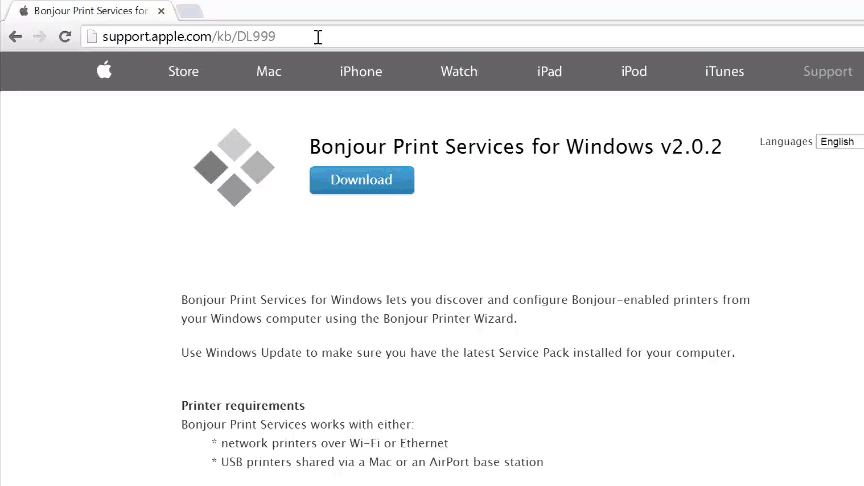

# Set Up Intel® XDK IoT Edition - Part 1: Installation

The [Intel® XDK IoT Edition](https://software.intel.com/en-us/html5/xdk-iot) lets you create and test applications on Intel® IoT platforms. It uses NodeJS to communicate with all the GPIOs, libraries, and packages. The IoT edition also provides NodeJS templates for creating new applications that interact with sensors and actuators, enabling you to get a quick start on developing for the Internet of Things. 

This document will guide you through installing the Intel® XDK IoT Edition IDE on either the Intel® Galileo or the Intel® Edison.

**Table of contents**

* [Install Intel® XDK IoT Edition »](#install-intel-xdk-iot-edition)
  * [Windows only: Install Bonjour »](#windows-only-install-bonjour)
* [Launch and sign into Intel® XDK »](#launch-and-sign-into-intel-xdk)

**Related videos**

[Setting Up The Intel XDK IoT Edition Part 1: Installation](https://software.intel.com/en-us/videos/setting-up-the-intel-xdk-iot-edition-part-1-installation)

## Install Intel® XDK IoT Edition

Get the latest [Intel® XDK IoT Edition installer](http://software.intel.com/en-us/html5/xdk-iot) for your computer's OS. Simply run the installer and follow the prompts.

[View detailed instructions »](details-install_xdk.md)

### Windows only: Install Bonjour

[Bonjour](http://support.apple.com/kb/DL999) (or zeroconf) is a service that enables the Intel® XDK to auto detect Intel® IoT devices on your network. This service is already available on Mac and Linux; only Windows users need to install an additional Bonjour service.

[View detailed instructions »](details-install_bonjour.md)

## Launch and sign into Intel® XDK

Before you can use the Intel® XDK, you must sign up for an Intel® XDK account or log in to a pre-existing account.

[View detailed instructions »](details-launch_xdk.md)

---

### Next Steps

Create and run a Hello Word project (blinking the onboard LED) on either the Intel® Galileo or the Intel® Edison.

* [Run a Sample Intel XDK for IoT Project »](/ide_setup-xdk/create_project.md)
