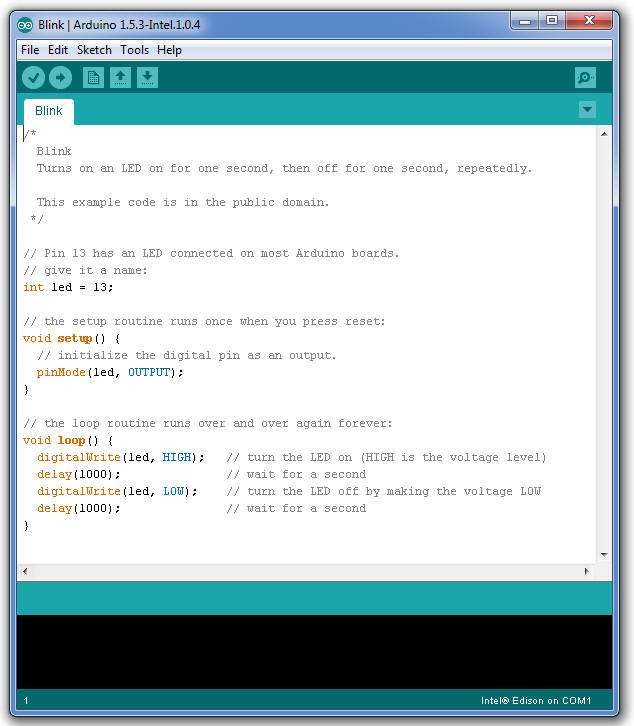
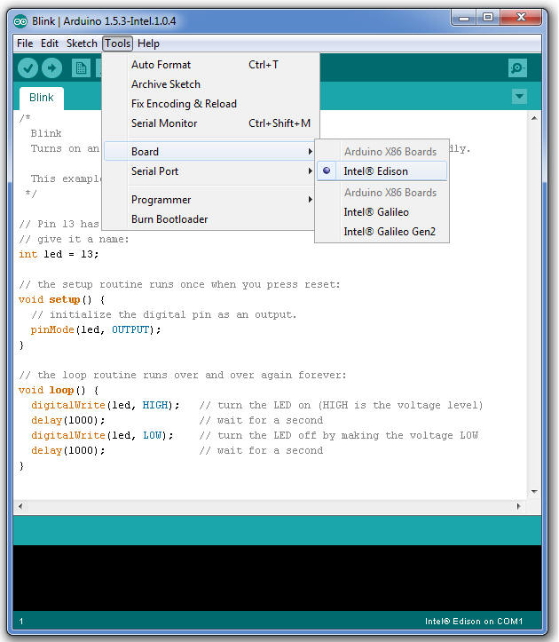
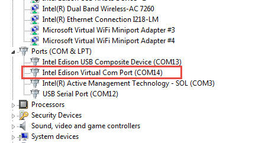
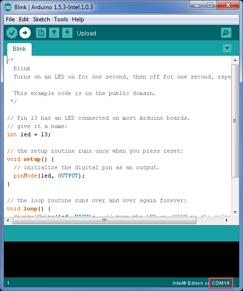
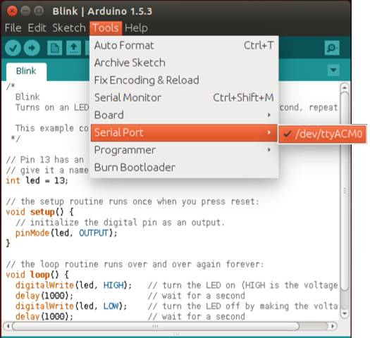
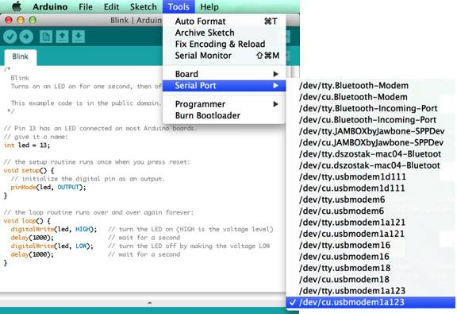
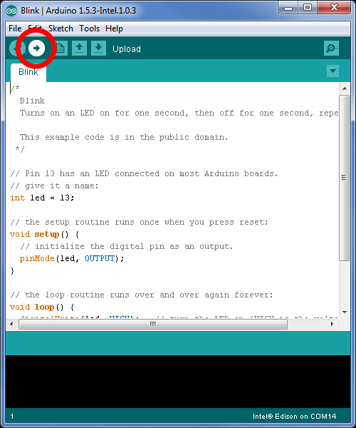
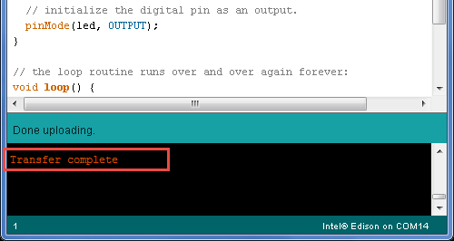
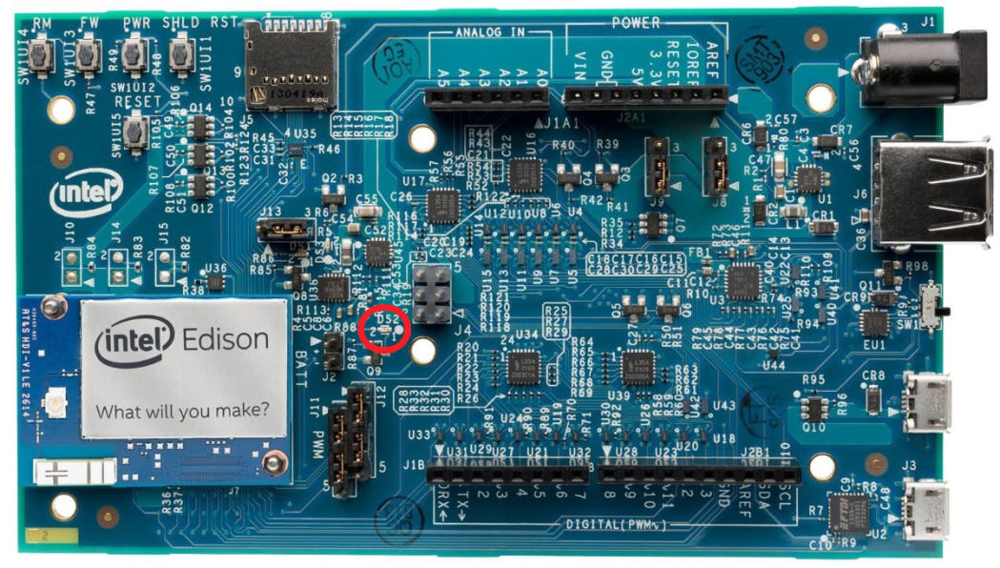

#Blinking an LED with the Arduino IDE on the Intel Edison Board

This guide will teach you how to run a sample sketch on your Intel® IoT board using the Arduino IDE. These instructions are geared toward the Intel® Edison module with the Arduino expansion board.

1. Run Arduino. 

2. Open the LED blink example sketch by choosing File > Examples > 1.Basics > Blink. 
  

3. Choose Tools > Board, then select your board.
  

4. Select the serial device of the board from the Tools > Serial Port menu. See the instructions below for your specific OS. 
  Note: The easiest way to find what port the board is using is by disconnecting your board, restarting the IDE, and re-opening the menu. The entry that disappears should be the Intel Edison board. Reconnect the board, restart the IDE, and select that serial port.
  * [Windows »](#finding-your-port-on-a-system-with-windows)
  * [Mac OS X »](#finding-your-port-on-a-system-with-mac-os-x)
  * [Linux »](#finding-your-port-on-a-system-with-linux)

### Finding your port on a system with Windows

* Find the port for your board, which is likely to be COM3 or higher and is called Intel Edison Virtual Com Port in the Device Manager. It is NOT USB Serial Port. COM1 and COM2 are usually reserved for hardware serial ports.
  

* Select your COM port.  
  

* Now the bottom right should match the COM port number of the Intel Edison Virtual Com Port (COM#) from the Device Manager.  
  

* Once you have selected your port, continue to upload the sketch to your board.

### Finding your port on a system with Linux

* Find the port for your board, which is likely to be /dev/ttyACM0. 
  

* Once you have selected your port, continue to upload the sketch to your board.

### Finding your port on a system with Mac OS X

* Find the port for your board, which is likely to be /dev/cu.usbmodemxxxx.
  

* Once you have selected your port, continue to upload the sketch to your board.

### Uploading the sketch to your board

1. Click the Upload icon in the upper left to load and run the sketch on your board.
  

2. You should see Done Uploading and Transfer complete messages when your sketch has uploaded. 
  

3. The DS2 LED on your board should now blink on or off every second. 
  

###Next Steps

If you have the Grove Starter Kit Plus Intel IoT Edition, here's how you add sensors:

1. Navigate to the Seeed-Studio github repo, https://github.com/Seeed-Studio/Sketchbook_Starter_Kit_V2.0.

2. Click Download ZIP.

3. Unzip, and copy to /libraries folder in your Arduino* folder.

4. Remove the period . in the folder name to make it: Sketchbook_Starter_Kit_V20. 

5. Restart the Arduino* IDE. 

6. Connect your desired sensor and run the code.

For a good hardware primer, check out the [Grove Starter Kit Wiki](http://www.seeedstudio.com/wiki/Grove_-_Starter_Kit_Plus), which includes an overview and example code for all the hardware included in the Grove Starter Kit Plus. If you have other hardware, searching for the name of your hardware in conjunction with "Arduino" will come up with example code and libraries to use. 

Note: The Intel Edison board with the Arduino expansion board and the Intel Galileo board can be treated as an Arduino Uno and is compatible with all Arduino Uno sensor shields. However it should be noted that Pins 10 and 11 on the Intel Edison board are NOT in fact capable of variable voltage output (PWM), despite being marked so on the expansion board.

* [Edison Arduino Expansion Board Hardware Guide](http://www.intel.com/support/edison/sb/CS-035275.htm)
* [Edison Arduino Expansion Board Schematic](http://www.intel.com/support/edison/sb/CS-035272.htm)
* [Edison Breakout Board Hardware Guide](http://www.intel.com/support/edison/sb/CS-035252.htm)
