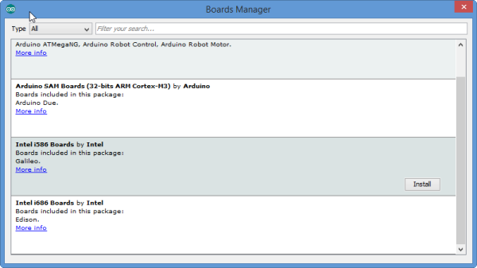
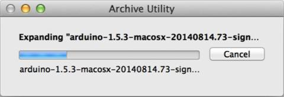
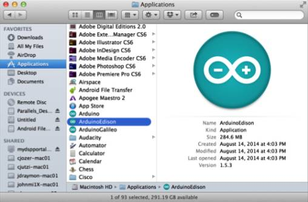
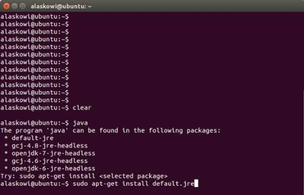
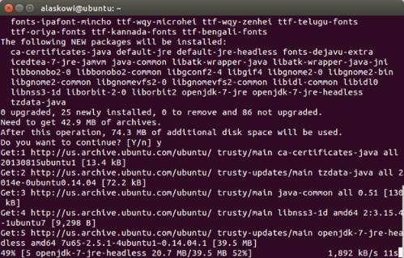
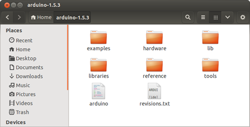
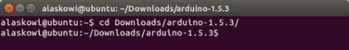
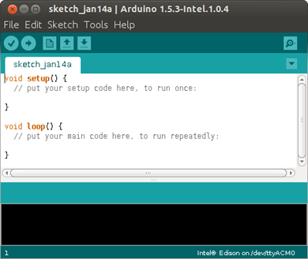

#Getting Started with the Arduino IDE

This guide contains steps to install the Arduino IDE on a system with Windows, Mac OSX, or Linux.  Please select your system from the choices below:
* [Windows »](#installing-arduino-on-windows)
* [Mac OS X »](#installing-arduino-on-mac-os-x)
* [Linux »](#installing-arduino-on-linux)

##Installing Arduino on Windows

1. Copy the **arduino-1.6.5-r2-windows.exe** file from the Windows directory on your USB stick to your desktop.

2. Go to your desktop, and double-click the arduino-1.6.5-r2-windows.exe file.

3. Click "I Agree" when prompted by the installer.

4. Click "Next" and then "Install" to install the Arduino IDE.  When prompted to install device software, select "Install".

5. Once the Arduino IDE is installed, you should see an Arduino shortcut on your desktop.  Double-click on it to open the Arduino IDE.

7. Choose Tools > Board > Boards Manager. The Boards Manager opens.
  

8. In the list of boards, select your board type. For example, if you have an Intel Edison board, select Intel i686 Boards, which includes the Intel Edison board.

9. Click Install.

10. When the installation process is finished, click OK.

##Installing Arduino on Mac OS X

1. Copy the **arduino-1.6.5-macosx.zip** file from the Mac directory on your USB stick to your Downloads folder.

2. Navigate to your Downloads folder where you copied the arduino-1.6.5-macosx.zip file and double-click it to open the archive. This will unzip an application in the Downloads folder called Arduino. 
  

3. Rename the Arduino file ArduinoEdison and move it into Applications. 
  

4. Double-click your renamed file. Arduino opens.

5. Choose Tools > Board > Boards Manager. The Boards Manager opens.
  

6. In the list of boards, select your board type. For example, if you have an Intel Edison board, selectIntel i686 Boards, which includes the Intel Edison board.

7. Click Install.

8. When the installation process is finished, click OK.

##Install Arduino on Linux

1. To check if you have Java installed, open a terminal and enter the command: `java`  
  

2. If you see the above message, you do not have Java installed and you will need to install it. To install the Java package, enter the command: `sudo apt-get install default.jre`  
  
 
 You may be prompted to enter your user password. 

3. Copy either the arduino-1.6.5-linux32.txz or arduino-1.6.5-linux64.txz archive from the USB stick to your desktop. Be sure to download the version for your operating system (32 bit or 64 bit).

4. Navigate to the folder where you copied the Arduino IDE .txz file and double-click it to open the archive.  
You can decompress the file from the command line. To do so, use xz by entering the following command: `unxz arduino-1.6.5-linux64.txz`

  If you don't have xz installed, install it by entering one of the following commands:
  * For Ubuntu or other Debian-based machines:  `sudo apt-get install xz-utils`
  * For Red Hat, Fedora, CentOS, or similar machines: `sudo yum install xz`

5. Click Extract and navigate to the directory where you would like to unzip the Arduino IDE. In this example, we will leave it in the Download directory. Click Extract.

6. The extracted folder should contain a file named arduino, as well as several folders. 
  

7. Open up a new Terminal window.

8. Navigate to the Arduino IDE folder. In in this example, the command will be `cd Downloads/arduino-x.x.x/`, where x.x.x is the Arduino IDE version number you downloaded.  Note: When you start typing in cd Downloads/arduino, you can press Tab to auto-complete the folder path.
  

9. To run Arduino with administrator privileges, enter the command: `sudo ./arduino`. If prompted, enter your password.
 
  
 
 The Arduino IDE opens.

10. In a serial communication window, check the availability of /ttyACM port by entering the following command: `ls /dev/ttyACM*`
 Note: If the /ttyACM* port is not available, here are several reasons why:
  * The modem manager is using the port. When the port becomes active, the modem manager can claim the port, blocking the IDE's access to the port. The exact command to remove it will depend on your Linux distribution. For example, the command `sudo apt-get remove modemmanager` may work.
  * The /ttyACM port was not created automatically when you plugged in your board. To add the port, do the following: 
    * Create a file: etc/udev/rules.d/50-arduino.rules
    * Add the following to the file: `KERNEL=="ttyACM[0-9]*", MODE="0666"`

11. Restart udev by entering the following command: `sudo service udev restart`
    If you are using a virtual machine (VM), you may need to reboot Linux within the VM.

12. Choose Tools > Board > Boards Manager. The Boards Manager opens.
  

13. In the list of boards, select your board type. For example, if you have an Intel Edison board, select Intel i686 Boards, which includes the Intel Edison board.

14. Click Install.

15. When the installation process is finished, click OK.

##Next Steps

Now that you have installed the Arduino IDE, see Blinking an LED with the Arduino IDE on the Intel® Edison board for steps to run a sample application to blink an LED on your board.
