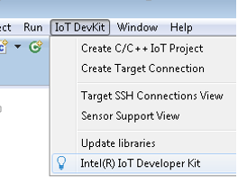
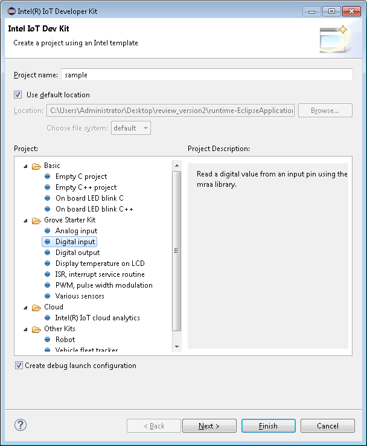
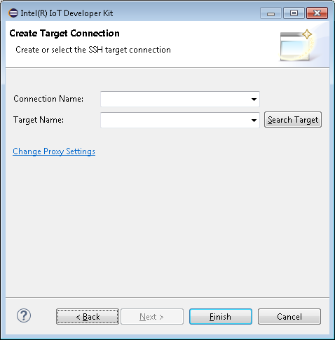
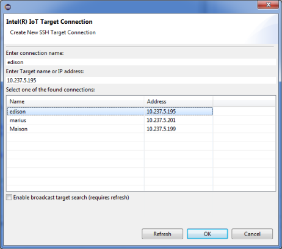
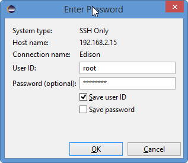
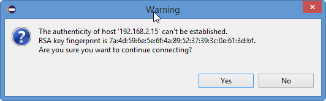

# Set Up Intel® IoT Dev Kit Eclipse - Part 2: Run a Sample Project

This document will guide you through creating and running a Hello Word project (blinking the onboard LED) on the Intel® Edison.

**Create a New Project**

1. Select **IoT DevKit > Create C/C++ IoT Project.**

   

2. Type a name for your project in the **Project name** field.
   
   

3. From the Project list, select **On board LED blink C++**. Click **Next**. The SSH Connection page displays.
4. To search for connections and select your board from a list, click **Search Target**. The Create Target Connection page opens.
   
   

5. By default, Eclipse searches for boards available via the Bonjour service and displays them in a list. If your board is not displayed in the list, select the **Enable broadcast target search** check box to widen your search to all devices on    your network.
6. From the list, select your board and click **OK**.

   

   Note: If you already know your board's connection information, you can type it manually. Do the following:
    * In the Connection Name field, type a name to use for the connection to your board.
    * In the Target Name field, type the IP address or host name of your board.

7. Click **Finish**. Your project is created.
8. From the **Run** drop-down list in the toolbar, select the name of your project.

   
   
9. In the **User ID** field, type the user name to log in to your board.
10. In the **Password** field, type the password for your board.

   
   
11. If a warning message about host authenticity displays, click Yes to upload and run your project.
 
   

12. Once your project runs, you'll see an LED blinking on your board, as shown below.

---

**Look at your Intel® Edison board for a blinking light.**
  
  The LED is located near the center of the board.

  

**Congratulations, you just ran your first C++ application!**

---

### Having troubles?

Refer to the [Troubleshooting - Intel XDK »](troubleshooting.md)

---

### Next Steps

Experiment with sample code supplied for available sensors and actuators.

* **[Grove Starter Kit - Intro »](/sensor_examples/grove_starter_kit/intro.md)**
  * [C++ »](https://software.intel.com/en-us/working-with-sensors-in-eclipse)
