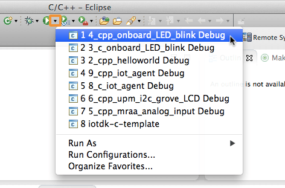

# Set Up Intel® IoT Dev Kit Eclipse - Part 2: Run a Sample Project

This document will guide you through creating and running a Hello Word project (blinking the onboard LED) on either the Intel® Galileo or the Intel® Edison.

**Table of contents**

* [Select a target IoT device »](#select-a-target-iot-device)
* [Build and run a sample application »](#build-and-run-a-sample-application)

**Related videos**

* [Set Up Intel IoT Dev Kit Eclipse – Part 2: Run a Sample Project](https://software.intel.com/en-us/videos/set-up-intel-iot-dev-kit-eclipse-part-2-run-a-sample-project)

## Select a target IoT device

To connect to your IoT board, you will need to configure Eclipse with your Intel® Edison or Intel® Galileo's IP address. [View detailed instructions »](details-select_target_device.md)

## Build and run a sample application

The version of Eclipse distributed with the developer kit has some example projects already built in. To start, build a blinking LED project from a pre-existing sample. [View detailed instructions »](details-build.md)

---

**Look at your Intel® IoT board for a blinking light.**

* **Intel® Galileo Gen 2**
  
  A green LED is located near the USB port.
  
  

* **Intel® Edison Kit for Arduino**
  
  The LED is located near the center of the board.

  

**Congratulations, you just ran your first Intel® XDK application!**

---

### Having troubles?

Refer to the [Troubleshooting - Intel XDK »](troubleshooting.md)

---

### Next Steps

Experiment with sample code supplied for available sensors and actuators.

* **[Grove Starter Kit - Intro »](/sensor_examples/grove_starter_kit/intro.md)**
  * [C++ »](/sensor_examples/grove_starter_kit/c/samples.md)
