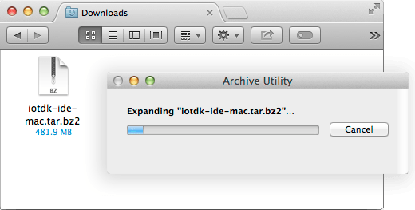

## Install Intel® IoT dev kit Eclipse IDE

Get the latest Eclipse IDE for Intel® IoT development. Download the compressed archive containing the customized IDE and extract the contents to your computer. 

**Important Note:** Windows users _must_ use **7-zip** for extraction.

---

1. Get the latest IoT dev kit Eclipse IDE package.

  **Hackathon attendees:**
  1. On the USB key: files → [your OS]
  2. Copy the appropriate **iotdk-ide** file to your computer:
    * **Windows**: iotdk-ide-win.7z
    * **Mac**: iotdk-ide-mac.tar.bz2 
    * **Linux**: iotdk-ide-linux.tar.bz2

---

Platform-specific instructions:

* [Windows »](#windows)
* [Mac »](#mac)
* [Linux »](#linux)


### Windows


1. Use 7zip to extract the archive: 

  ---

  **Use 7Zip only. Do not use any other Windows file archiver utility.**

  7zip supports extended file paths which some of the contents of the compressed file have so only use 7zip software to extract the file. 

  ---

  1. **Right-click** on **iotdk-ide-win.7z**.

  2. Select "**7zip**", then "**Extract here**". 

    

2. Wait for the extraction process to finish. It will take a a few minutes.


### Mac

1. Double-click **iotdk-ide-mac.tar.bz2** to extract the contents of the archive.

  


### Linux

1. Extract the contents of **iotdk-ide-linux.tar.bz2**.

  1. Open a new Terminal window.

  2. `cd` into the directory that contains the .bz2. e.g. If you copied the file to your desktop: 

    ```
    cd ~/Desktop/
    ```

  3. Extract the tar.bz2. The process will take a a few minutes. 

    ```
    tar -jxvf iotdk-ide-linux.tar.bz2
    ```
