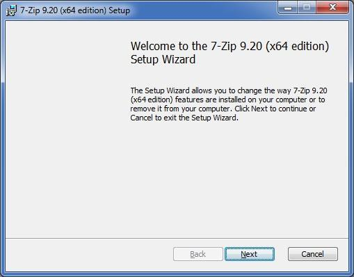

### Install 7Zip (Windows only)

[7zip](http://www.7-zip.org) supports extended file paths which some of the contents of the compressed file have so only use 7zip software to extract the file. 

---

1. Download the **7-Zip** installer software from [7-zip.org](http://www.7-zip.org).

  
  
  *Based on whether your Windows is 32-bit or 64-bit, download either the .msi or .exe version.*

2. Double-click on the downloaded .exe or .msi to launch the 7zip installer.

3. Follow the instructions in the installation wizard, clicking "Next" where needed.

  
