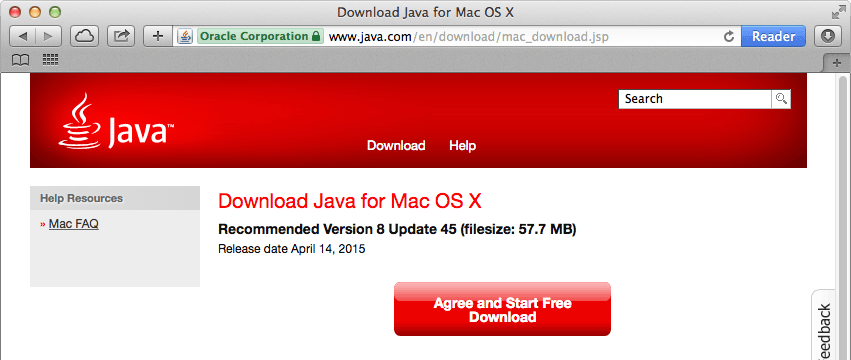

## Install Java

Eclipse depends on either a Java Runtime Engine (JRE) or Java Development Kit (JDK). Check if you have Java installed and, if you do not, install it.

---

**Platform-specific instructions:**

* [Windows »](#windows)
* [Mac »](#mac)
* [Linux »](#linux)

### Windows

If you do not know if you have Java installed, refer to [How can I find which version of Java is installed without running an applet in Windows or Mac?](https://www.java.com/en/download/help/version_manual.xml) on java.com for instructions.

1. Download the Oracle distribution of a Java JRE or JDK from [oracle.com/technetwork/java/javase/downloads/index.html](http://www.oracle.com/technetwork/java/javase/downloads/index.html).

  


### Mac

A Java runtime ships with the Mac operating system however, if you are running OS X 10.9.4 or older, you may need to update your version of Java.

1. If needed, download the Oracle distribution of Java for Mac from [java.com/en/download/mac_download.jsp](https://www.java.com/en/download/mac_download.jsp).

  


### Linux

1. Check if you have Java installed.

    1. Open a Terminal window.

    2. Type:

    ```
    java
    ```
    
    If you see a "The program ‘java’ can not be found" message, you do not have Java installed and you will need to install it.

2. Install a Java runtime using the `apt-get` command. You may need to enter your user password.

  ```
  sudo apt-get install default.jre
  ```
