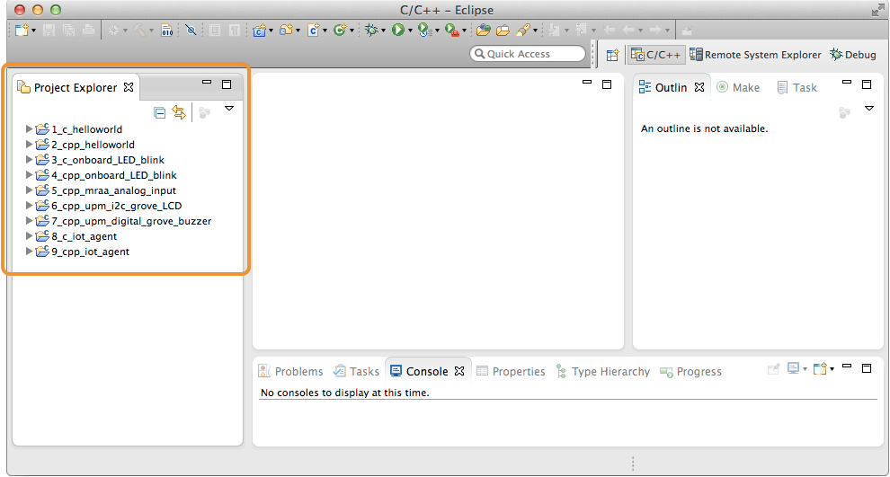

## Launch Eclipse using batch file

Use devkit-launcher.bat to launch Eclipse with all the necessary Intel® IoT environment settings. Use the launcher batch file (instead of eclipse.exe) to launch Eclipse **every time**.

---

1. Once the archive file is extracted, go into the resulting *iotdk-ide* directory.

2. Double-click on *devkit-launcher* to launch the IoT dev kit Eclipse IDE.

  On Windows, you may need to right-click on *devkit-launcher.bat* and select "**Run as administrator**".

  

---

You should see a command line window appear (and quickly disappear, if you are on Windows) and the Eclipse IDE will launch using the iot-devkit workspace. 

Note the example projects already loaded in the "Project Explorer" panel on the left.

