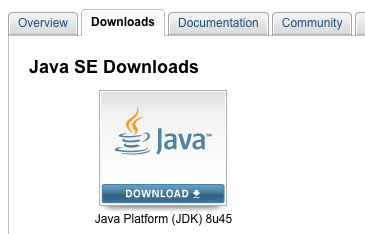

# Set Up Intel® IoT Dev Kit Eclipse - Part 1: Installation

The Intel® IoT Developer Kit ("dev kit") lets you create and test applications on Intel® IoT platforms. The Eclipse IDE distributed with the dev kit facilitates writing IoT applications in C and C++.

This document will guide you through installing the Eclipse IDE distributed with the Intel® IoT Developer Kit on either the Intel® Galileo or the Intel® Edison.

**Table of contents**

* [Install prerequisite software »](#install-prerequisite-software)
  * [Install 7Zip (Windows only) »](#install-7zip-windows-only)
  * [Install Java »](#install-java)
* [Extract Intel® IoT dev kit Eclipse IDE »](#extract-intel-iot-dev-kit-eclipse-ide)
* [Launch Eclipse using batch file »](#launch-eclipse-using-batch-file)

**Related videos**

* [Set Up Intel IoT Dev Kit Eclipse – Part 1: Installation](https://software.intel.com/en-us/videos/set-up-intel-iot-dev-kit-eclipse-part-1-installation)

## Install prerequisite software

Depending on your computer's operating system, you may need to install additional software in order to use the dev kit version of Eclipse.

### Install 7Zip (Windows only)

[7zip](http://www.7-zip.org) supports extended file paths which some of the contents of the compressed file have so only use 7zip software to extract the file. [View detailed instructions »](details-install_7zip.md)

### Install Java

Eclipse depends on either a Java Runtime Engine (JRE) or Java Development Kit (JDK). Check if you have Java installed and, if you do not, install it. [View detailed instructions »](details-install_java.md)

## Extract Intel® IoT dev kit Eclipse IDE

Get the latest [Eclipse IDE for Intel® IoT](http://software.intel.com/en-us/iot/downloads) development. Download the compressed archive containing the customized IDE and extract the contents to your computer. **Important Note:** Windows users _must_ use **7-zip** for extraction. [View detailed instructions »](details-extract_iot_eclipse.md)

## Launch Eclipse using batch file

Use devkit-launcher.bat to launch Eclipse with all the necessary Intel® IoT environment settings. Use the launcher batch file (instead of eclipse.exe) to launch Eclipse **every time**. [View detailed instructions »](details-launch_eclipse_batch.md)

---

### Having troubles?

Refer to the [Troubleshooting - Intel XDK »](troubleshooting.md)

---

### Next Steps

Create and run a Hello Word project (blinking the onboard LED) on either the Intel® Galileo or the Intel® Edison.

* [Run a Sample Eclipse Project »](/ide_setup/eclipse/create_project.md)
