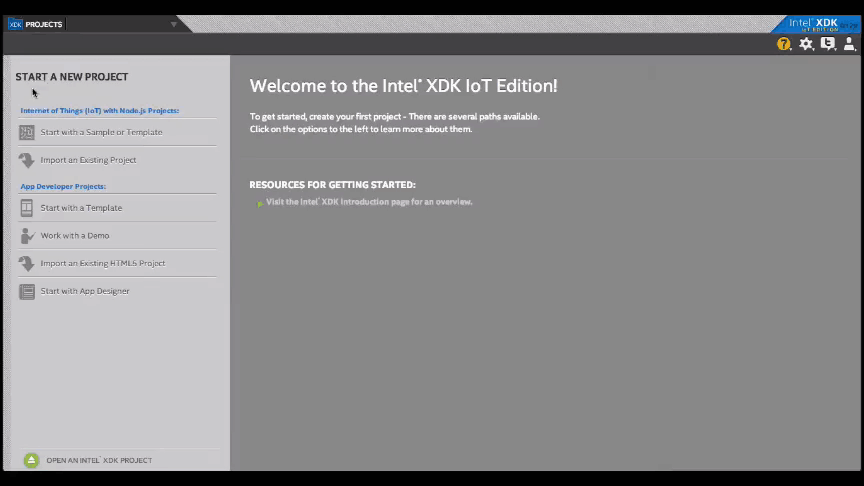
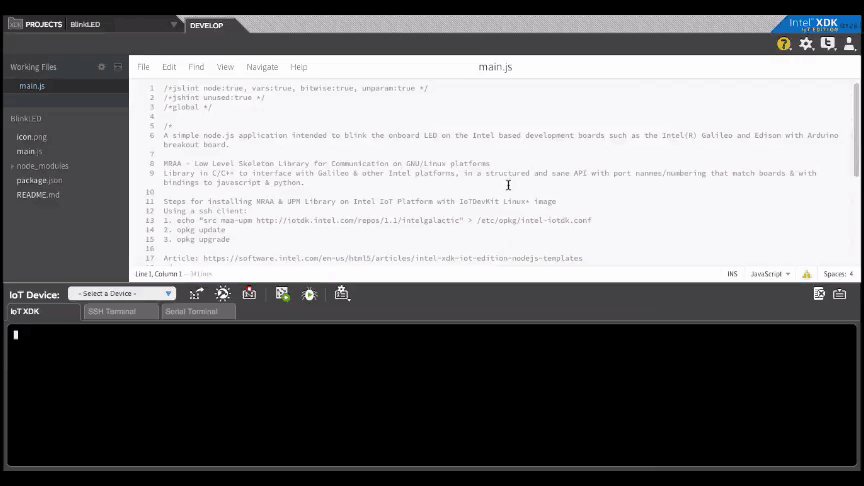
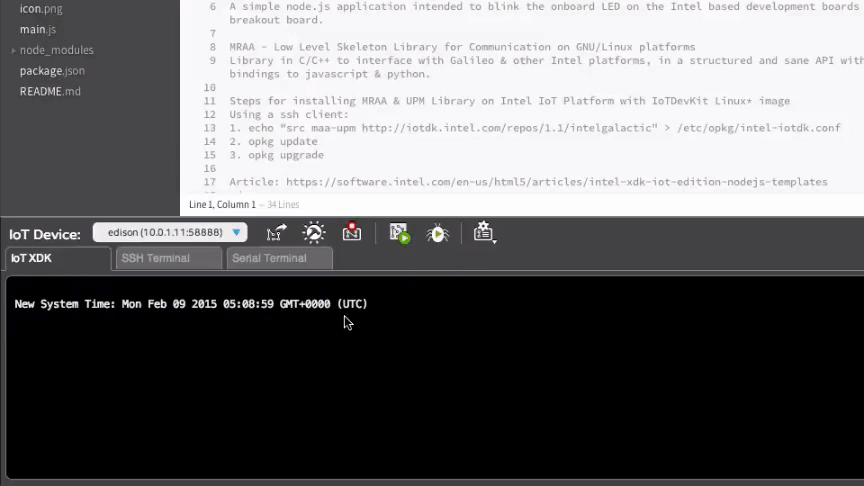
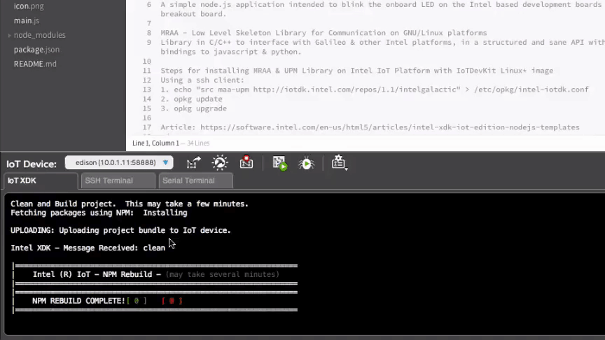

# Set Up Intel® XDK IoT Edition - Part 2: Run a Sample Project

This document will guide you through creating and running a Hello Word project (blinking the onboard LED) on either the Intel® Galileo or the Intel® Edison.

**Table of contents**

* [Create a project »](#create-a-project)
* [Select a target IoT device »](#select-a-target-iot-device)
* [Sync device clocks »](#sync-device-clocks)
* [Build the application »](#build-the-application)
* [Upload and run the application »](#upload-and-run-the-application)

**Related videos**

[Setting Up The Intel XDK IoT Edition Part 2: Run a Sample Project](https://software.intel.com/en-us/videos/setting-up-the-intel-xdk-iot-edition-part-2-run-a-sample-project)

### Create a project

The Intel® XDK IoT Edition has various project creation options. To start, create a blinking LED project from a pre-existing sample.

[View detailed instructions »](details-create_project.md)

### Select a target IoT device

The Intel® XDK IoT Edition will automatically detect Intel® IoT devices on your network and display them in the "IoT Device" drop down list.

[View detailed instructions »](details-select_target_device.md)

### Sync device clocks

Sync your computer's time with the clock on the target board to avoid timing issues. Do this step any time you connect to a new target IoT device or the device has been powered off.

[View detailed instructions »](details-sync_clock.md)

### Build the application

Fetch all the Node modules specified in package.json and install them on the IoT device. Run build any time you create a new project, or add/remove Node modules from an existing project.

[View detailed instructions »](details-build.md)

---

### Upload and run the application

Upload the project files to the IoT device and run it. Remember that every time you make changes to files and you want to see the changes: (1) save the file, (2) upload, (3) run.

[View detailed instructions »](details-upload_run.md)

---

**Look at your Intel® IoT board for a blinking light.**

* **Intel® Galileo Gen 2**
  
  A green LED is located near the USB port.
  
  

* **Intel® Edison Kit for Arduino**
  
  The LED is located near the center of the board.

  

**Congratulations, you just ran your first Intel® XDK application!**

---

### Having troubles?

Refer to the [Troubleshooting - Intel XDK »](troubleshooting.md)

---

### Next Steps

Experiment with sample code supplied for available sensors and actuators.

* **[Grove Starter Kit - Intro »](/sensor_examples/grove_starter_kit/intro.md)**
  * [JavaScript »](/sensor_examples/grove_starter_kit/javascript/samples.md)
