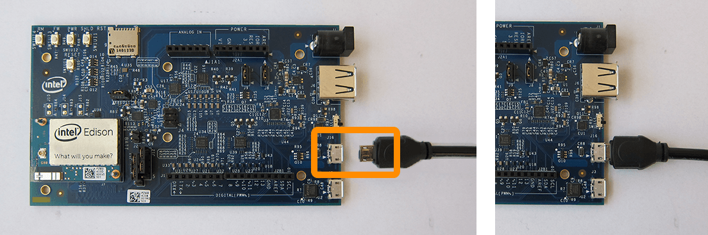
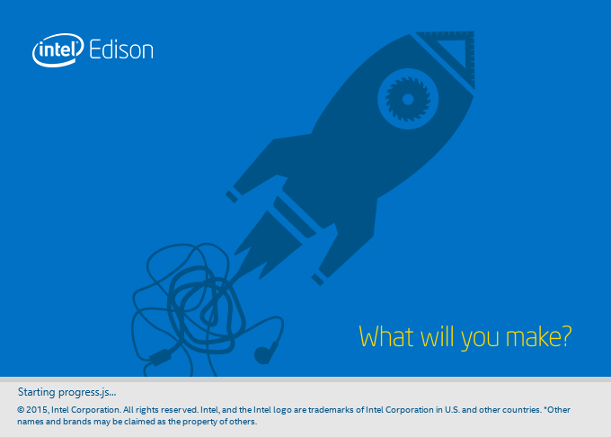

# Set Up Your Computer - Windows (64-bit integrated installer)

_Instructions for the **Intel® Edison** on **Windows 64-bit**_

The Windows 64-bit integrated installer program gives you options to automatically install Windows drivers and an IDE of your choice for Intel® Edison development. You can also use the integrated installer program to flash the latest firmware image on your Intel® Edison.

This setup document will guide you through preparing your computer with the Intel® Edison Windows 64-bit integrated installation program.

---

**Are you running 32-bit Windows? Unable to use the integrated installer?**

You will need to install the Windows drivers manually. Refer to [Set Up Your Computer - Windows (manual installation)](manual_installation.md). 

---

**Table of contents**

* [Download and run the Intel® Edison integrated installer](##download-and-run-the-intel-edison-integrated-installer)
* [Restart your computer](#restart-your-computer)

**Related videos**

[Intel Edison: Set Up Your Computer - Windows Integrated Installer (preview video)]()

## Download and run the Intel® Edison integrated installer

The integrated installer program for 64-bit Windows gives you options to automatically install:

* Intel® Edison and FTDI serial drivers on your Windows computer,
* an IDE of your choice (Arduino, Intel XDK® for IoT, and/or Eclipse), and
* the latest firmware image on your Intel® Edison.

1. Get the latest Intel® Edison 64-bit Windows installer.

	**Online option:**

	1. Visit the Intel® Edison Software Downloads page: [software.intel.com/iot/hardware/edison/downloads](https://software.intel.com/iot/hardware/edison/downloads).
	2. Scroll down to the "**Driver software**" section. 
	3. Click the "**Windows 64-bit Integrated Installer**" link to download  _iotdk_win_installer.exe_ to your computer
	
	**Hackathon attendees:**

	1. On the USB key:  files →  Windows
	2. Copy  _iotdk_win_installer.exe_ to your computer.

2. Connect a micro-USB cable to the **device mode** micro-USB port of the Intel® Edison expansion board, and the other end to your computer.

	

	Refer to [_Connecting Cables_](../assembly/arduino_expansion_board/connecting_cables.md#device-mode-micro-usb-cable) for more detailed cable connection information.

3. Double-click on the  *iotdk_win_installer.exe* on your computer to begin installation. 

	

4. Follow the installation wizard. Click "**Next**" where needed. 

	---

	**Is the "Next" button greyed out?**

	The integrated installer is unable to detect your Intel® Edison. Ensure that the board is powered on and plugged into your computer via the device mode micro-USB port on the expansion board.

	Otherwise you will need to install the Windows drivers manually. Refer to Set Up Your Computer - Windows (manual). 

	---

5. The default settings can be adjusted to your needs, or leave the defaults as is. 

	

	In the component selection screen, check the options you would like to install:

    * **Drivers:** 
    
    	Installs the Intel® Edison drivers and FTDI serial drivers for Windows.

    * **Update image:** 
    
    	Flashes the latest firmware image directly on your Intel® Edison.
    	
    	(Note: You will not be able to use this option until after you have installed the drivers. Re-run the integrated installer if you wish to use it to flash Intel® Edison firmware.)

    * **Development Environment:** Choose from 

        * **Arduino Software** (simplified C++), 

        * **Intel® XDK IoT Edition** (JavaScript), and/or 

        * **Eclipse** (C/C++).

6. When done, click "**Finish**" to close the installation wizard. 
If there are any errors during installation, you will need to resolve them manually.

## Restart your computer

To ensure driver installation changes take effect, reboot your Windows computer at this point.

1. Based on your version of Windows, select the option to fully shut down and restart your computer.

	

---

### Next Steps

[Confirm driver installation »](confirm_drivers.md)

