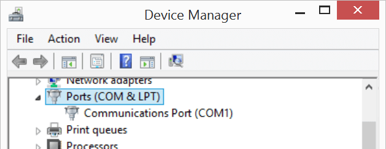
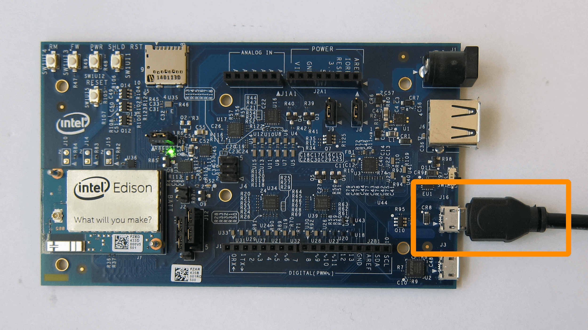

# Confirm driver installation - Windows 

_Instructions for the **Intel® Edison** on **Windows 32-bit or 64-bit**_

**Table of contents**

* [Open Windows Device Manager »](#open-windows-device-manager)
* [Confirm installation of Intel® Edison Drivers »](#confirm-installation-of-intel-edison-drivers)
* [Confirm installation of FTDI serial drivers »](#confirm-installation-of-ftdi-serial-drivers)

**Related videos**

* [Intel Edison: Set Up Your Computer Manually - Windows (preview video)]()
* [Intel Edison: Set Up Your Computer - Windows Integrated Installer (preview video)]()

## Open Windows Device Manager

Launch the Device Manager utility on Windows in order to debug your Intel® IoT board USB connections.

1. Launch  Device Manager.

	* **Windows 7 and below:**
	
		1. Open  Start menu.
		2. Start typing "device manager" in the search field. 
		3. Select "Device Manager" under "Control Panel"
	
	* **Windows 8:**
		1. Go into Windows Desktop mode.
		2. Right-click on the  Start menu button.
		3. Select "Device Manager".
		
1. In  Device Manager, locate and toggle open "**Ports (COM & LPT)**".

	

## Confirm installation of Intel® Edison Drivers

1. Connect a micro-USB cable to the **device mode** micro-USB port of the Intel® Edison expansion board, and the other end to your computer.

	

	Refer to [_Connecting Cables_](../arduino_expansion_board-assembly/connecting_cables.md#device-mode-micro-usb-cable) for more detailed cable connection information.

If you see both "**Intel Edison USB Composite Device**" and "**Intel Edison Virtual Com Port**" items show up in Device Manager under "Ports (COM & LPT)", the drivers have been successfully installed. 

**Do not see Intel® Edison devices show up in Device Manager?**

* Check that the Intel® Edison is in device mode.
	* Arduino expansion board: the microswitch is toggled downwards.
	* Xadow expansion board: the microswitch is toggled towards "Device" label.
* Check that the micro-USB cable is securely connected to the device mode micro-USB port of the Intel® Edison expansion board.
* Restart your computer to ensure driver changes to take effect.
* Try a different micro-USB cable to eliminate errors due to a bad cable.
* Update the firmware on the Intel® Edison. Refer to [Flash Edison Firmware Manually]().

## Confirm installation of FTDI serial drivers

1. Power the Intel® Edison via the **device mode** micro-USB port and/or via the power barrel connector.

	 or 

2. Connect a micro-USB cable to the **UART/serial** micro-USB port of the Intel® Edison expansion board, and the other end to your computer.

	

	Refer to [_Connecting Cables_](../arduino_expansion_board-assembly/connecting_cables.md#uartserial-micro-usb-cable) for more detailed cable connection information.

If you see "USB Serial Port" show up in Device Manager under "Ports (COM & LPT)", the drivers have been successfully installed. 

---

### Next Steps

Gain command line access of your IoT board. Execute special Linux commands to configure your IoT board such as setting up Wi-Fi. 

[Shell Access - Windows »](../shell_access/windows.md)