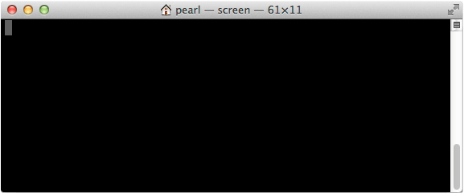

## Establish a serial connection

Use the Screen utility in Terminal to gain command line access of your IoT board. For example: `screen /dev/tty.usbserial-A102GW3T 115200`


---

1. Connect to the USB serial device using the Terminal "screen" utility. 

  ```
  screen /dev/xx.usbserial-XXXXXXXX 115200
  ```

  * **Replace "/dev/xx.usbserial-XXXXXXXX" with your device's unique name.** 

  * "115200" indicates the baud rate. **Always use 115200.**

  * "-L" turns on output logging so you can see what the result of your commands are.

2. When you see a blank screen, **press the Enter key**.
 
  **For Intel® Edison boards running older firmware**: You may need to press the Enter key **twice**.

  

3. Once connected you will see a login prompt. 

  Type in "**root**" for the username and press **Enter**.

  
