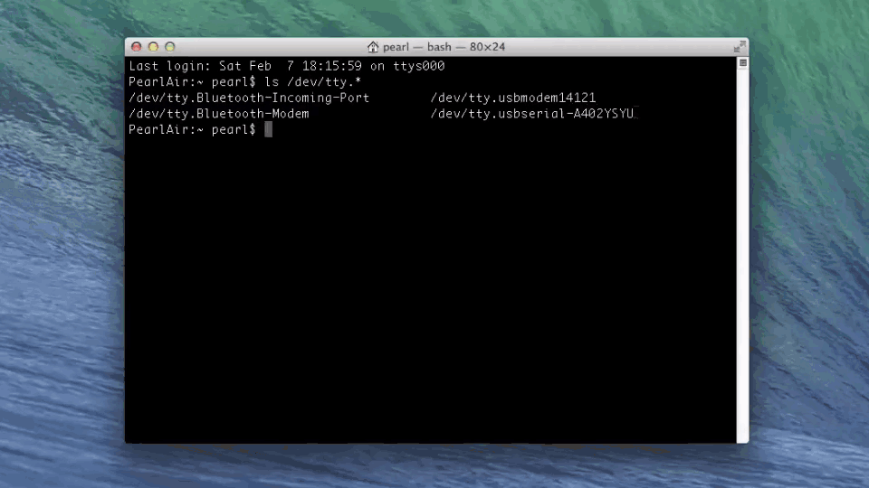

# Shell Access - Mac 


If you need to configure your IoT board, you will need to remotely connect to the Intel® Edison or Intel® Galileo. Once connected to your Intel® IoT board, you have access to the Linux-based Yocto operating system running on the board. 

You can then execute special Linux commands such: changing the hostname and password, setting up Wi-Fi, or flashing new firmware.


**Related videos**

[Shell Access – Mac](https://software.intel.com/en-us/videos/shell-access-mac)


**Table of contents**

* [Identify the "usbserial" device name »](#identify-the-usbserial-device-name)
* [Establish a serial connection »](#establish-a-serial-connection)


## Identify the "usbserial" device name 

Use the `ls /dev/tty.*` command in Terminal to find the device name of the "**usbserial**" connection. You will need the exact device name for use in [Establish a serial connection](#establish-a-serial-connection) next.


[View detailed instructions »](details-identify_usbserial.md)


## Establish a serial connection

Use the Screen utility in Terminal to gain command line access of your IoT board. For example: `screen /dev/tty.usbserial-A102GW3T 115200`



[View detailed instructions »](details-screen_connection.md)

---

You are now logged into your IoT board and can run shell commands. For example, to output the version number of the firmware running on your board:

```
cat /etc/version
```


The firmware version is in YYYYMMDDHHMM format so, in this case, Sept 3, 2014.

---

### Additional resources

For more info on using Screen such as quitting, read [Using Screen »](using_screen.md)


### Next Steps

Some Edison boards have older firmware images on them. You **_may_** need to update the firmware to a newer version to get access to important features.

[Flash Edison Firmware Manually »](../flash_firmware/manual.md)


