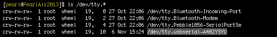

# Shell Access - Mac 

Instructions for the **Intel® Galileo** and **Intel® Edison** on **Mac**

This setup document will guide you through establishing a serial connection to either the Intel® Galileo or the Intel® Edison using a Mac computer.

If you need to configure your IoT board, you will need to remotely connect to the Intel® Edison or Intel® Galileo. Once connected to your Intel® IoT board, you have access to the Linux-based Yocto operating system running on the board. 

You can then execute special Linux commands such:

* changing the hostname and password, 
* setting up Wi-Fi, or 
* flashing new firmware.


**Related videos**

[Shell Access – Mac]()


**Table of contents**

* [Identify the "usbserial" device name]()
* [Establish a serial connection]()


## Identify the "usbserial" device name 

Use Terminal to find the device name of the USB serial connection. You will need the exact device name for use in Establish a serial connection later.

1. Launch  Terminal.

	**Option 1:**
	
	a. Launch Spotlight (type Cmd+Space).
	b. Type "terminal". 
	c. Select the "Terminal" app.
	
	**Option 2:**

    a. Go to Applications on your Mac. 
	b. Open Utilities. 
	c. Launch Terminal.app.

2. Use the "ls" command to list any connected devices.

```
ls /dev/tty.*
```

3. Look for a device that contains "**cu.usbserial**" or "**tty.usbseria**l".

	

	In this case, the device found was "/dev/tty.usbserial-A402YSYU".

	---

	**Don't see a "usbserial" device listed?**

	* Do you have the UART/serial cable connected?
	* Refer to Assembly (for your expansion board) → UART/serial micro-USB cable.
	* Is your IoT board powered on?

	---


# Establish a serial connection

Use the Screen utility in Terminal to gain command line access of your IoT board. For example: `screen /dev/cu.usbserial-A102GW3T 115200`

1. Connect to the USB serial device using the  Terminal "screen" utility. **Replace "/dev/xx.usbserial-XXXXXXXX" with your device's unique name.** "115200" indicates the baud rate. **Always use 115200.**

	```
	screen /dev/xx.usbserial-XXXXXXXX 115200
	```

2. When you see a blank screen, **press the Enter key**.
 
	**For Intel® Edison boards running older firmare**: You may need to press the Enter key **twice**.

	

3. Once connected you will see a login prompt. 

	Type in "**root**" for the username and press **Enter**.

	

---

You are now logged into your IoT board and can run shell commands. For example, in order to output the version number of the firmware running on your board:

```
cat /etc/version
```

The firmware version is in YYYYMMDDHHMM format so, in this case, Sept 3, 2014.

---

### Additional resources

For more info on using Screen such as quitting, read [Using Screen »](using_screen.md)


### Next Steps

Some Edison boards have older firmware images on them. You **_may_** need to update the firmware to a newer version to get access to important features.

[Flash Edison Firmware Manually »](../flash_firmware/manual.md)


